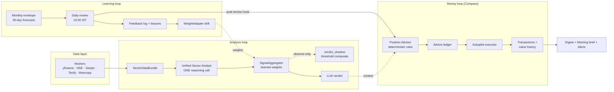
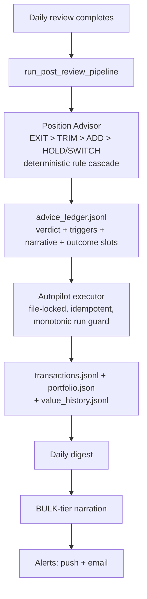

# StockAgent — System Architecture

> **The current-state design document.** One page that explains how the whole
> system fits together as deployed today. The deep-dive documents
> ([TECHNICAL_DESIGN](TECHNICAL_DESIGN.md), [RL_DESIGN](RL_DESIGN.md),
> [AGENTIC_DESIGN](AGENTIC_DESIGN.md), [AUTOPILOT_GUIDE](AUTOPILOT_GUIDE.md),
> [CHAT_ARCHITECTURE](CHAT_ARCHITECTURE.md)) explain each subsystem's internals;
> this document is the map that connects them.
>
> Verified against the deployed code on **2026-07-19** (post audit Waves A–I —
> see [audit/LEDGER.md](audit/LEDGER.md) for the finding-by-finding history).

---

## 1. What the System Is

StockAgent is a self-learning stock research engine for Indian equities with a
virtual portfolio bolted on top. Three loops run continuously, each feeding the
next:

1. **Analysis loop** — score a stock across sector-specific dimensions with one
   reasoning-LLM call, aggregate into a verdict (BUY / ADD / HOLD / NEUTRAL /
   SELL / EXIT).
2. **Learning loop (RL)** — every trading day, compare yesterday's predicted
   close against the real close, assign credit/blame to scoring dimensions,
   drift their weights, and accumulate per-stock lessons.
3. **Money loop (Compass)** — score every *held* position after the daily
   review, write the verdict to a permanent advice ledger, and let a
   deterministic executor trade a **virtual** portfolio from those verdicts
   (mock money, real NSE prices, full audit trail; no broker, ever).

Everything else — discovery funnel, morning brief, chat assistant, backups —
exists to feed or expose those three loops.



---

## 2. Runtime Topology

One Railway service, one Docker image, one persistent volume.

| Piece | Reality |
|---|---|
| Process model | `uvicorn` with **2 workers**; FastAPI app from `services/api/server.py`; a file-lock singleton ensures background jobs run in exactly one worker |
| Scheduler | APScheduler `BackgroundScheduler` **in-process** (no separate scheduler service) — 16 jobs, all cron-timed in `Asia/Kolkata` |
| Storage | Everything durable lives under `data/` on the mounted Railway volume (JSON/JSONL/parquet/SQLite — no external database) |
| Frontend | `src/frontend/prototypes/` — vanilla-React JSX served statically at `/app/index.html`; installable as a PWA (service worker + VAPID push); the old `src/frontend/web` React scaffold was deleted (audit Wave E) |
| LLM access | All calls go through OpenRouter via `services/clients/llm_client.py` (single client factory; per-call telemetry) |
| Alert delivery | Web-push (VAPID) + email (SMTP); both optional, guarded by env vars |

**Deploy discipline:** pushing to `main` auto-deploys, and a deploy **kills any
in-flight scheduled job** in the old container. Never push between **16:25 and
17:15 IST on a trading day** (the daily review + trading pipeline window). A
killed run is recoverable via `POST /scheduler/backfill?skip_existing=true`.

---

## 3. The Clock — All 16 Scheduled Jobs (IST)

The daily rhythm is the easiest way to understand the system:

| # | Time | Job | What it does |
|---|------|-----|--------------|
| 1 | 00:00 daily | Prompt deploy | Commits edited prompt files back to GitHub |
| 2 | 07:30 Mon–Fri | Macro news (policy) | RBI/policy headlines → macro news cache |
| 3 | 08:45 Mon–Fri | **Pre-open shock check** | Living Envelope: overnight gap vs envelope → shock re-forecast if breached |
| 4 | 08:50 Mon–Fri | **Morning brief** | Deterministic assembly (digest, regime, overnight HIGH-severity news, earnings ≤3 sessions, IPO/lock-in watch) + ONE bulk-LLM headline → push + email |
| 5 | 09:00/12:00/15:00 Mon–Fri | Macro news (market hours) | Intraday macro headline refresh |
| 6 | **16:30 Mon–Fri** | **RL daily review** | The heart: score yesterday's forecast per ticker (cron from `config.yaml feedback_cron`) — then event-triggers the **post-review portfolio pipeline** (advisor → autopilot → digest → alerts) |
| 7 | 19:00 Mon–Fri | Bhavcopy EOD sync | Official NSE end-of-day prices → parquet EOD store |
| 8 | 23:30 daily | **Nightly backup** | Zips ledgers + predictions + telemetry (caches excluded), 7-copy rotation on the volume + emails the zip off-site (≤20 MB) |
| 9 | Sat 10:00 | Dossier event ingestion | News → structured ticker-dossier events |
| 10 | Sat 11:00 | Dossier question research | Researches open questions the dossier curator raised |
| 11 | Sat 12:30 | **Weekly discovery funnel** | Universe (~2,150) → 5-signal screen → dark signals → ~10 LLM deep-dives → conviction shelf → paper-lane envelopes + weekly paper reviews |
| 12 | Sun 18:00 | Weekly review + index watch | Portfolio week-in-review narration + index RL check |
| 13 | Mon 03:30 | Ledger stale-lesson cleanup | Ages out stale RL lessons |
| 14 | 1st 02:00 | Monthly scorecard | Baseline duel: RL forecasts vs naive baselines per ticker |
| 15 | 1st 09:00 | Monthly forecast | Fresh 30-day envelope per managed ticker |
| 16 | Dec 31 23:00 | NSE holiday calendar update | Refreshes next year's trading calendar |

Reliability contract for the money-path job (#6): a slow ticker harvest can
never silently kill the day — the harvest has an aggregate time budget with the
`TimeoutError` contained, stragglers are logged by name, zero-output and
partial-output conditions email an ops alert, the post-review pipeline hook
runs regardless, and every run records its outcome to
`data/scheduler_job_outcomes.json`, surfaced as `last_runs` in
`GET /scheduler/status`. An APScheduler `EVENT_JOB_ERROR` listener emails on
any job crash as the final backstop.

---

## 4. Analysis Loop

**Path:** `backend/shared/pipeline/base_orchestrator.py` (shared by all sectors
via `sector_router`).

1. **Resolve** free text → NSE ticker (exact managed-ticker match short-circuits;
   LLM only for unknown text).
2. **Bundle** — `bundle_builder` performs ONE set of fetches into a
   `SectorDataBundle`: price history + technicals (C++-accelerated indicators),
   fundamentals, news (date-filtered to a 3-day window), macro context, FII/DII
   flows, F&O snapshot, off-market deals, corporate events.
3. **Unified Sector Analyst** — ONE reasoning-tier call scores **all**
   dimensions of the sector (9 automobile / 6 banking / 8 IT / 6 renewable / 8
   generic) from that bundle. The legacy one-agent-per-dimension pool survives
   only as an automatic fallback (`UNIFIED_ANALYST_FALLBACK_LEGACY`).
4. **SignalAggregator** applies **learned weights** (RL WeightAdapter output ×
   regime multipliers × lesson emphasis), detects dimension conflicts, and asks
   the LLM for the final verdict + score.
5. **Verdict shadow lane** *(observe-only, audit Wave G)* — alongside the LLM
   verdict, `verdict_shadow.py` computes `threshold(composite)` from the same
   weighted scores and appends `{composite, threshold_verdict, llm_verdict,
   diverged}` to `data/rl/verdict_shadow.jsonl`. The LLM verdict stays
   authoritative; the shadow data decides (analysis ~2026-07-31) whether the
   deterministic verdict should be hard-bound.

Sector coverage: 4 native sectors + a **generic** sector graph for tickers the
discovery funnel promotes from outside those four.

## 5. Learning Loop (RL)

Full internals in [RL_DESIGN.md](RL_DESIGN.md); the shape:

- **Monthly envelope** — per ticker, a 30-trading-day forecast (per-day p10/p50/p90
  from 500 Monte Carlo paths over an LLM-shaped profile), stamped with the
  weight version used.
- **Daily review** (16:30, reviews the *previous* trading day) —
  1. fetch the actual close, **cross-checked** against NSE's official EOD API
     (`close_verifier`: tolerance compare, symbol-poisoning detector; non-finite
     or non-positive closes are rejected as data failures);
  2. score direction & error vs the envelope row. **Direction semantics (Wave
     G): a NEUTRAL prediction is correct only when the move was actually FLAT**
     — the old rule credited NEUTRAL unconditionally, inflating accuracy;
  3. LLM feedback agent assigns credit/blame per dimension → append to the
     per-ticker feedback log; miss patterns become **lessons**;
  4. **WeightAdapter** drifts dimension weights (bounded, versioned);
  5. dossier curator (weekly cadence) distills durable per-stock knowledge.
- **Living Envelope** — regime detector (VIX / FII proxy / RSI → RISK_ON /
  NORMAL / RISK_OFF with sticky streaks) + the 08:45 pre-open shock check that
  re-forecasts the envelope mid-cycle when an overnight gap breaks it.
- **Guard rails** — every learning write goes through per-ticker JSON stores
  under `data/predictions/<sector>/<ticker>/`; the paper lane (below) uses an
  isolated store root and **hard-disables** all learning writes.

## 6. Money Loop (Compass)

Full internals in [AUTOPILOT_GUIDE.md](AUTOPILOT_GUIDE.md). Iron rules: virtual
money only; the LLM narrates but **never decides a trade**; the executor is a
pure function over advice records.



Notable properties, each earned by a specific audit finding:

- **Cash-chain integrity** — every transaction records `cash_before/after`;
  dividends credit cash with explicit `DIV` ledger rows; corporate actions
  (splits/bonuses) adjust via `corp_actions.py`; a reconciler detects (does not
  silently fix) ledger-vs-state drift.
- **Concurrency** — the whole pipeline run holds a file lock with a fresh
  reload before write (two uvicorn workers exist).
- **Timing** — the advisor works on trading-date D−1 data reviewed on day D at
  16:30; a verdict is executed by the *next* run. The morning brief therefore
  shows the freshest *existing* verdicts — a position can legitimately show ADD
  at 08:50 and be exited at ~16:45 when new data flips the verdict.

## 7. Discovery Funnel + Paper Lane

Saturday 12:30. Universe (~2,150 NSE symbols) → deterministic 5-signal screen →
"dark" signals (insider buying, MF holding changes, bulk/block deals,
surveillance flags) → top-N LLM deep dives → **conviction shelf** (bounded;
displacement by conviction). Every active shelf idea gets a **paper envelope**
(same forecast machinery, isolated store, zero learning writes) and a weekly
paper review — so an idea arrives with a verifiable paper track record before
anyone acts on it. IPO tracker adds listing + lock-in-expiry awareness.

## 8. Delivery & Ops

- **Channels** (`core/delivery/channels.py`): web-push (PWA, VAPID) + email
  (SMTP). Send-then-record: the sent-log stores a `delivered` flag, so a failed
  delivery is retried the same day instead of being deduped into silence; stale
  push subscriptions (404/410/400/403) are pruned; a send that lands nowhere
  (push=0, email=0) logs a WARNING.
- **Ops alerts** (`core/delivery/ops_alerts.py`): job crashed / zero-output /
  partial-output / portfolio-reconcile mismatch → broadcast to all subscribed
  users. The scheduler's error listener is the backstop.
- **Morning brief** (`core/delivery/brief.py`): deterministic sections
  (portfolio state, advisor flags, regime, overnight HIGH-severity items,
  earnings within 3 sessions, discovery adds, IPO/lock-in watch) + exactly one
  BULK-tier narration call for the headline, with a deterministic fallback.
- **Backups** (`services/data/backup.py`): nightly zip of the non-rebuildable
  volume subset, 7-copy rotation + email off-site. SQLite is snapshotted via
  the backup API (never file-copied live).
- **Observability**: `GET /scheduler/status` = RL per-ticker state + envelope +
  weight versions + `last_runs` job outcomes + `fallback_events_today`
  (legacy-pool engagements, each ~6-8× the unified path's Serper cost —
  logged to `data/rl/fallback_events.jsonl`); `telemetry.db` records **every**
  LLM call (caller, model, tokens, latency, success) with per-model cost rates
  from `config.yaml llm.cost_rates`.

## 9. LLM Tiering & Cost Model

| Tier | Model | Used for |
|---|---|---|
| FAST | `qwen3.6-flash` | Ticker resolution, cheap classification, **chat loop default** |
| REASONING | `glm-5.2` | Unified analyst, signal aggregation, feedback agent, deep dives, chat escalation |
| BULK | `deepseek-v4-flash` | All narration (briefs, digests, advice text) |

Rules that keep this sane:

- `config.yaml` is the **sole** model-selection source (env aliases deleted).
- Every JSON-mode call sends `JSON_MODE_EXTRA_BODY` (provider quirk guard) and
  goes through the shared client factory — no inline `OpenAI()` constructions.
- Chat runs on a **45-second per-turn wall-clock budget** with capped retries
  (≤4 upstream attempts per logical call) and one guaranteed budget-free final
  synthesis; reasoning is disabled by default on chat calls.
- Scheduled recurring spend ≈ **$3.3–3.6/month** at current OpenRouter prices
  (dominated by the daily review). Cost exposure lives in on-demand chat +
  `/analyse`, which is why those are budgeted and telemetered.

## 10. Security Posture

- **Write-path gate**: all mutation routes (`/ui/*` writes, prompt editing)
  check `X-Scheduler-Key` when `SCHEDULER_KEY` is set — **currently dormant**
  (unset) by explicit owner decision; the PWA already carries the client half
  (localStorage key + one-time 403 prompt). Push subscribe/unsubscribe is
  keyless *by design* (pre-login 🔔 must work).
- Prompt-file writes escape into safe Python string literals (no `"""` or
  trailing-backslash breakout into the imported module).
- Error responses are generic; exception details are logged server-side only.
- CORS: no wildcard-with-credentials.
- **Public-repo hygiene**: prod cash figures, hostnames, and auth specifics stay
  out of committed docs; local prod-backup extracts (`analysis_data/`) are
  gitignored.

## 11. Data Volume Layout

```
data/
├── portfolio/<user>/          # THE money records
│   ├── portfolio.json         #   holdings + cash (file-locked)
│   ├── transactions.jsonl     #   append-only trade ledger (cash chain)
│   ├── advice_ledger.jsonl    #   every verdict ever, with outcome slots
│   ├── value_history.jsonl    #   daily equity curve
│   ├── digests/ briefs/ weekly/
├── predictions/<sector>/<ticker>/   # RL memory per stock
│   ├── <T>_<cycle>_prediction_envelope.json
│   ├── <T>_<cycle>_daily_feedback_log.json
│   ├── <T>_agent_weight_memory.json · <T>_dossier.json · <T>_learning_ledger.json
├── rl/verdict_shadow.jsonl    # Wave G shadow lane (observe-only)
├── rl/paper/                  # isolated paper-lane store (discovery shelf)
├── discovery/                 # shelf.json, screens, shelf_events.jsonl
├── delivery/                  # alerts_sent.jsonl, push_subscriptions.json
├── backups/                   # nightly zips (7-copy rotation)
├── rl/fallback_events.jsonl   # legacy-pool fallback engagements (Wave I)
├── telemetry.db               # every LLM call
├── chat_sessions.db           # chat session memory (shared across workers, 7d TTL)
└── scheduler_job_outcomes.json
```

## 12. Reading Order for New Developers

1. This document (the map).
2. [CODEBASE.md](../CODEBASE.md) — module-by-module quick reference + API routes.
3. The subsystem you're touching:
   [RL_DESIGN](RL_DESIGN.md) · [AUTOPILOT_GUIDE](AUTOPILOT_GUIDE.md) ·
   [CHAT_ARCHITECTURE](CHAT_ARCHITECTURE.md) · [AGENTIC_DESIGN](AGENTIC_DESIGN.md) ·
   [TECHNICAL_DESIGN](TECHNICAL_DESIGN.md).
4. [audit/LEDGER.md](audit/LEDGER.md) — why the code is shaped the way it is:
   every hardening decision above traces to an `AUD-###` finding there.

Historical records (frozen, do not update): `docs/superpowers/plans/` and
`docs/superpowers/specs/` — the implementation plans and design specs as they
were approved, kept as provenance.
