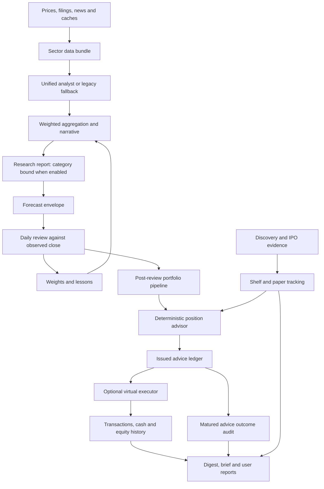

# StockAgent — System Architecture

**Current-code edition: 2026-09-15**, inspected at
`9a805878ed19c0cda7833d5b897ac05ee407436d`.
For the detailed KT, schedules, storage and all planned PI changes, read
[TECHNICAL_DESIGN.md](TECHNICAL_DESIGN.md) or its
[PDF](StockAgent-Three-Loops.pdf). Functional team duties are a separate
[testing guide](TEAM_TESTING_GUIDE.md).

The [September 10 repository/production audit](audit/2026-09-10-repository-production-review.md)
remains the detailed operational evidence. A September 15 Railway check found
the latest deployment SUCCESS at the same commit; it did not reverify jobs,
delivery, recovery or learning benefit. The [PI tracker](planning/PI-2026-09/STATE.json)
records remediation acceptance separately.

## Runtime

| Component | Inspected implementation |
|---|---|
| Application | FastAPI from `services/api/server.py`; Docker uses Python 3.11 and two Uvicorn workers. |
| Background ownership | One worker binds a localhost TCP port and starts scheduled/background work. Container-local guard; no continuous standby takeover. |
| Scheduler | In-process APScheduler, up to 24 job IDs depending on gates and valid cron. IST schedule in KT section 9. |
| Storage | JSON/JSONL, parquet and SQLite under configured data paths; production volume was `/app/data` in the September 10 snapshot. |
| Frontend | Served `src/frontend/prototypes/` JSX/PWA; runtime browser transformation, no compiled frontend build. |
| External dependencies | Market/search providers, OpenRouter-compatible model client, optional SMTP and web push. |
| Health | `/health` is process liveness, not scheduler/data readiness. |

## Three connected product loops

Research labels and portfolio actions have different contracts. BUY is not a
purchase; HOLD is not a flat forecast. The virtual executor uses deterministic
rules, gates, cash/size limits and deduplication; no broker execution path was
identified. Narration explains the decision rather than deciding a trade.

Learning persists feedback, weights and lessons. It currently has known
label/timing/final-bound problems. The SA-039 switch `rl.learning_mode`
(accepted 2026-09-25; checked in as `adapt` until the owner activates it) can contain it: in `observe` mode,
decisions use each sector's default weights, no weight file is written and
lessons stop moving scores ([KT section 5](TECHNICAL_DESIGN.md#5-learning-forecast-review-and-memory)).
The nightly auditor, monthly replay and
weekly scoreboard are different measurements; none alone demonstrates the
benefit of adaptation. The watchdog checks operational milestones, not stock
prediction correctness.

**Planned (adopted 2026-09-26, not implemented):** the
[one-engine design](superpowers/specs/2026-09-26-one-engine-sector-lenses-design.md)
replaces the per-sector graphs with one engine:

- a sector lens (YAML) supplies the peers, benchmark and KPIs;
- code computes five factors;
- one LLM reader turns news and filings into dated events, and code derives a
  sixth factor from them;
- code decides and the LLM explains.

It switches only after it proves at least as good as today's analyst in shadow.
Learning then tunes six weights pooled across all stocks.

## Current versus planned

| Already present | Planned in PI-2026-09 |
|---|---|
| Central graph routing, unified scoring, durable run/health logs | Usable-data semantics, action gates, store lineage, sector lenses and the factor engine (one-engine design) |
| Hard-bound categorical research verdict under current YAML | Immutable issuance, correct grading and retry-safe bounded adaptive updates |
| Virtual advice, execution, P/L and outcome reports | Complete matched cohorts and prospective evidence of learning benefit |
| IPO calendar/history/capture and recent-listing heuristic | Future validated IPO modeling is not a completed September deliverable |
| Job outcomes, watchdog, outbox and backups | Truthful completion, verified transport/recovery and background readiness |
| JSX/PWA and live adapters | Safe rendering, honest unavailable/demo states and optional build cleanup |

See KT section 12 for every SA story. Documentation changes with each
implementation; SA-031 remains the final consistency check. Updating these
documents under DOC-001 does not accept those unresolved changes.
