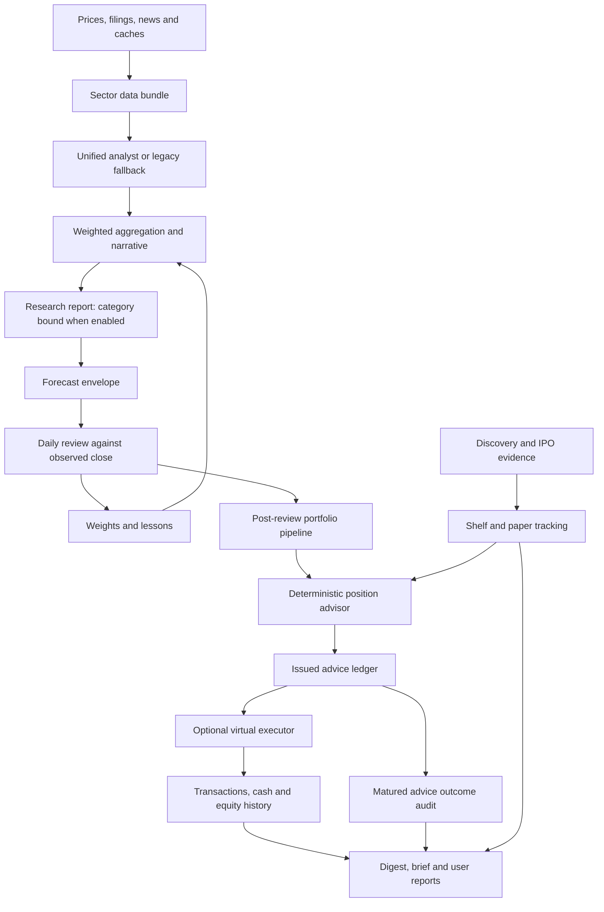

# StockAgent — System Architecture

**Current-code edition: 2026-09-15**, inspected at
`9a805878ed19c0cda7833d5b897ac05ee407436d`.
For the detailed KT, schedules, storage and all planned PI changes, read
[TECHNICAL_DESIGN.md](TECHNICAL_DESIGN.md) or its
[PDF](StockAgent-Three-Loops.pdf). Functional team duties are a separate
[testing guide](TEAM_TESTING_GUIDE.md).

The [September 10 repository/production audit](audit/2026-09-10-repository-production-review.md)
remains the detailed operational evidence. A September 15 Railway check found
the latest deployment SUCCESS at the same commit; it did not reverify jobs,
delivery, recovery or learning benefit. The [PI tracker](planning/PI-2026-09/STATE.json)
records remediation acceptance separately.

## Runtime

| Component | Inspected implementation |
|---|---|
| Application | FastAPI from `services/api/server.py`; Docker uses Python 3.11 and two Uvicorn workers. |
| Background ownership | One worker binds a localhost TCP port and starts scheduled/background work. Container-local guard; no continuous standby takeover. |
| Scheduler | In-process APScheduler, up to 24 job IDs depending on gates and valid cron. IST schedule in KT section 9. |
| Storage | JSON/JSONL, parquet and SQLite under configured data paths; production volume was `/app/data` in the September 10 snapshot. |
| Frontend | Served `src/frontend/prototypes/` JSX/PWA; runtime browser transformation, no compiled frontend build. Chat replies are rendered through `chat-markdown.js` (SA-001, accepted 2026-09-26, committed as `8413b59`): raw HTML shows as text, DOMPurify keeps only Markdown tags and http(s) links, and CDN scripts are exact versions with SRI. |
| External dependencies | Market/search providers, OpenRouter-compatible model client, optional SMTP and web push. |
| Health | `/health` is process liveness, not scheduler/data readiness. |

## Three connected product loops

```mermaid
flowchart TD
    D[Prices, filings, news and caches] --> B[Sector data bundle]
    B --> U[Unified analyst or legacy fallback]
    U --> A[Weighted aggregation and narrative]
    W[Weights and lessons] --> A
    A --> R[Research report: category bound when enabled]
    R --> E[Forecast envelope]
    E --> F[Daily review against observed close]
    F --> W
    F --> P[Post-review portfolio pipeline]
    P --> V[Deterministic position advisor]
    V --> L[Issued advice ledger]
    L --> X[Optional virtual executor]
    X --> T[Transactions, cash and equity history]
    L --> O[Matured advice outcome audit]
    T --> S[Digest, brief and user reports]
    O --> S
    I[Discovery and IPO evidence] --> C[Shelf and paper tracking]
    C --> V
    C --> S
```

Research labels and portfolio actions have different contracts. BUY is not a
purchase; HOLD is not a flat forecast. The virtual executor uses deterministic
rules, gates, cash/size limits and deduplication; no broker execution path was
identified. Narration explains the decision rather than deciding a trade.

Each analysis run writes a data-health row. Since SA-002 (accepted
2026-09-26 by its fresh re-review, after a rework; committed as `8413b59`), each bundle section's
status comes from its producer rather than from its text: verified, stale,
fallback, empty, not applicable, failed or unverified. A row is `ok` only when
every dimension scored and every applicable section is verified and fresh. The
essential price and fundamental sections are listed separately.

SA-003 (accepted by its fresh review 2026-09-27, committed as `167f08b`) turns those
statuses into a decision gate on every report: `abstain` when an essential
section is unusable, fewer than half the dimensions scored, or the run has no
bundle; `degraded` (still actionable) when only ordinary enrichment is
missing; otherwise `actionable`. Forecast rows carry the gate of the run that
issued them, and grading and virtual buys need a close from the session's own
bar. It ships as `decision_gate.mode: record`, which records what enforcement
would stop and changes nothing. In `enforce` an abstaining report reads
INSUFFICIENT DATA, and no forecast, learning update or new-risk buy (ADD, or
a SWITCH's buy leg) rests on it. Exits and trims are never blocked
([KT sections 4–6](TECHNICAL_DESIGN.md#4-research-input-to-recommendation)).

SA-008 (accepted by its fresh review on 2026-09-30, committed as `02c43f6`, not yet deployed) adds security
identity to that gate. The instrument registry, `config/instruments.yaml`,
replaces the undated `YF_SYMBOL_OVERRIDES` dict. It holds effective-dated
records of which provider symbol a ticker is priced from, on which price basis,
and whether its identity is resolved: evidence resolves an identity, and
nothing is needed to quarantine one. An unresolved identity, or price history
fetched for another symbol, abstains. A forecast row is graded only against a
close on its own basis. A holding whose basis changed since purchase (a
demerger) is held, exits included, until an operator reconciles it with
`python -m core.portfolio.identity_reconcile`: a read-only plan, then an
apply approved by the plan's digest. TATAMOTORS ships unresolved; by the owner's
decision of 29 Sep, the passenger-vehicle company is tracked as its own ticker, TMPV.

Learning persists feedback, weights and lessons. It currently has known
label/timing/final-bound problems. The SA-039 switch `rl.learning_mode`
(accepted 2026-09-25; production runs `observe` since 2026-09-26 through the Railway variable `RL_LEARNING_MODE`) contains it: in `observe` mode,
decisions use each sector's default weights, no weight file is written and
lessons stop moving scores ([KT section 5](TECHNICAL_DESIGN.md#5-learning-forecast-review-and-memory)).
Each ticker's learning lives in one store, `data/predictions/<managed sector>/<TICKER>/`.
SA-009 (accepted 2026-09-30, committed as `313e3f6`) fixes the writers that also created
`automobile/<TICKER>` copies for other sectors' tickers. It adds a read-only
store inventory and a reversible quarantine for such copies, which is not yet
run in production ([KT section 3](TECHNICAL_DESIGN.md#3-runtime-configuration-and-storage)).
The nightly auditor, monthly replay and
weekly scoreboard are different measurements; none alone demonstrates the
benefit of adaptation. The watchdog checks operational milestones, not stock
prediction correctness.

**Planned (adopted 2026-09-26, not implemented):** the
[one-engine design](superpowers/specs/2026-09-26-one-engine-sector-lenses-design.md)
replaces the per-sector graphs with one engine:

- a sector lens (YAML) supplies the peers, benchmark and KPIs;
- code computes five factors;
- one LLM reader turns news and filings into dated events, and code derives a
  sixth factor from them;
- code decides and the LLM explains.

It switches only after it proves at least as good as today's analyst in shadow.
Learning then tunes six weights pooled across all stocks.

## Current versus planned

| Already present | Planned in PI-2026-09 |
|---|---|
| Central graph routing, unified scoring, durable run/health logs; usable-data health semantics (SA-002, accepted, committed as `8413b59`); the essential-data decision gate, recording only (SA-003, accepted, committed as `167f08b`); security identity and lifecycle records (SA-008, accepted 2026-09-30, committed as `02c43f6`); prediction-store ownership, inventory and quarantine (SA-009, accepted 2026-09-30, committed as `313e3f6`) | Enforcing the gate (owner decision after a measured record period), switching production from TATAMOTORS to TMPV, quarantining the stray stores in production, row-level store lineage, sector lenses and the factor engine (one-engine design) |
| Hard-bound categorical research verdict under current YAML | Immutable issuance, correct grading and retry-safe bounded adaptive updates |
| Virtual advice, execution, P/L and outcome reports | Complete matched cohorts and prospective evidence of learning benefit; costs and tax in paper P/L, idle cash put to work in normal markets (hold cash only in a crisis), one sizing rule for every autopilot buy, and the portfolio shown against the Nifty (SA-048–SA-051) |
| IPO calendar/history/capture and recent-listing heuristic | Future validated IPO modeling is not a completed September deliverable |
| Job outcomes, watchdog, outbox and backups; truthful daily-review outcome counts (SA-004, accepted 2026-09-27, committed as `241c393`); delivery retry/dead-letter contract and owner outbox view (SA-006, accepted 2026-09-28 after its re-review, committed as `15dcda1`; deployed 2026-09-28 as `00b94de9`); backup manifests, a nightly restore drill, an encrypted off-site adapter and the `backup_recoverable` watchdog check (SA-007, accepted by its fresh review 2026-09-29, committed as `165d152`, deployed 2026-09-29 as `26b442f4`) | Durable outcomes for every job, measured receipt, an owner-configured off-site bucket with a recorded off-site restore, and background readiness |
| JSX/PWA and live adapters | Safe rendering, honest unavailable/demo states and optional build cleanup |

See KT section 12 for every SA story. Documentation changes with each
implementation; SA-031 remains the final consistency check. Updating these
documents under DOC-001 does not accept those unresolved changes.
