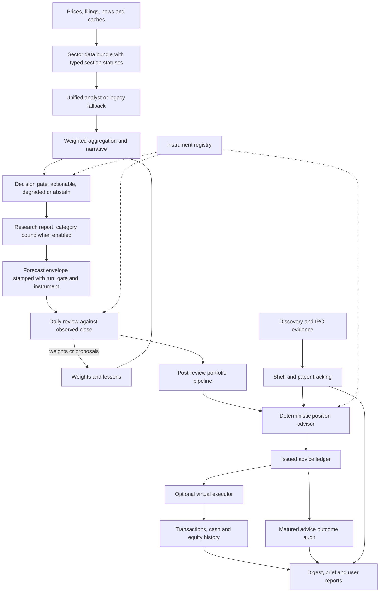

# StockAgent — System Architecture

**Edition:** 2026-10-10 · **Code inspected:** `61c85d6df9b3dae7eeebd875c70409a9d0d6a024`, the code production runs.

This is the short map of how StockAgent fits together. The
[technical design](TECHNICAL_DESIGN.md) and its [PDF](StockAgent-Three-Loops.pdf)
hold the detail: every contract, record, job and worked example, the dated
production state, and the planned redesign. Functional testing duties are in the
separate [testing guide](TEAM_TESTING_GUIDE.md). The
[September 10 audit](audit/2026-09-10-repository-production-review.md) is the
baseline evidence that the current design responds to, and the
[PI tracker](planning/PI-2026-09/STATE.json) records story status.

## Runtime

| Component | Implementation |
|---|---|
| Application | FastAPI from `services/api/server.py`; Docker with Python 3.11 and two Uvicorn workers. |
| Background ownership | One worker binds a localhost TCP port and runs the scheduler, RL self-heal, cleanup and the optional outbox drainer. A container-local guard; no standby takeover. |
| Scheduler | In-process APScheduler: up to 24 job IDs, registered by gates and valid cron, all in IST ([KT section 9](TECHNICAL_DESIGN.md#9-scheduled-jobs-and-event-hooks)). |
| Storage | JSON/JSONL, parquet and SQLite under `data/`, on one Railway volume mounted at `/app/data`. |
| LLM tiers | OpenRouter, three tiers in `config.yaml`: fast `qwen/qwen3.6-flash` for the chat tool loop; reasoning `z-ai/glm-5.2` for judgment calls (unified analyst, aggregator verdict, RL feedback and thesis); bulk `deepseek/deepseek-v4-flash` for high-volume JSON scoring. |
| External services | Market data (yfinance, NSE), search (Tavily, Serper), email over SMTP or Resend, web push, and an optional S3-compatible off-site bucket. |
| Frontend | Served `src/frontend/prototypes/` JSX/PWA with runtime browser transformation; no compiled build. |
| Health | `/health` is process liveness, not scheduler, data or delivery readiness. |

## Three connected product loops

```mermaid
flowchart TD
    D[Prices, filings, news and caches] --> B[Sector data bundle with typed section statuses]
    B --> U[Unified analyst or legacy fallback]
    U --> A[Weighted aggregation and narrative]
    W[Weights and lessons] --> A
    A --> G[Decision gate: actionable, degraded or abstain]
    G --> R[Research report: category bound when enabled]
    R --> E[Forecast envelope stamped with run, gate and instrument]
    E --> F[Daily review against observed close]
    F -->|weights or proposals| W
    F --> P[Post-review portfolio pipeline]
    P --> V[Deterministic position advisor]
    V --> L[Issued advice ledger]
    L --> X[Optional virtual executor]
    X --> T[Transactions, cash and equity history]
    L --> O[Matured advice outcome audit]
    T --> S[Digest, brief and user reports]
    O --> S
    I[Discovery and IPO evidence] --> C[Shelf and paper tracking]
    C --> V
    C --> S
    K[Instrument registry] -.-> G
    K -.-> F
    K -.-> V
```

Research labels and portfolio actions have different contracts. BUY is not a
purchase, and HOLD is not a flat forecast. The virtual executor uses
deterministic rules, gates, cash and size limits, and deduplication. No broker
execution path exists. Narration explains a decision; it does not decide a
trade.

## Cross-cutting controls

**Data health and the decision gate.** Every bundle section reports a typed
status from its producer, never from its text: verified, stale, fallback,
empty, not applicable, failed or unverified. Each analysis writes one
data-health row, which is `ok` only when every dimension scored and every
applicable section is verified and fresh. The decision gate reads the same
statuses and labels every report:
- `abstain` when an essential section (fundamentals, technicals, peers
  valuation) is unusable, fewer than half the dimensions scored, the run has
  no bundle, or the identity check fails;
- `degraded`, still actionable, when only ordinary enrichment is missing;
- `actionable` otherwise.

One switch, `decision_gate.mode`, governs every consumer. In `record`, the
default, the gate is computed and logged and nothing changes. In `enforce`, an
abstaining report reads INSUFFICIENT DATA, and no forecast, learning update or
new-risk buy (ADD, or a SWITCH's buy leg) rests on it. Exits and trims are
never blocked by missing data
([KT sections 4–6](TECHNICAL_DESIGN.md#4-research-input-to-recommendation)).

**Instrument identity.** The registry, `config/instruments.yaml`, holds
effective-dated records of which provider symbol a ticker is priced from, on
which price basis, and whether its identity is resolved. Evidence resolves an
identity; nothing is needed to quarantine one. A tracked ticker resolves to
itself without an LLM call. An unresolved identity, or price history fetched
for another symbol, abstains. A forecast row is graded only against a close on
its own basis. A holding whose basis changed since purchase (a demerger) is
held, exits included, until an operator reconciles it with
`python -m core.portfolio.identity_reconcile`, a read-only plan followed by an
apply approved by the plan's digest.

**Learning mode.** `rl.learning_mode` decides whether learned state may move
decisions. In `adapt` the review updates live weights and lesson emphasis. In
`observe`, decisions use each sector's default weights, no weight file is
written, the would-be update is recorded as a proposal, and lessons stop
moving scores
([KT section 5](TECHNICAL_DESIGN.md#5-learning-forecast-review-and-memory)).
Learning persists feedback, weights, lessons and dated dossier knowledge. It has
known label, timing and final-bound problems, which the planned work below
addresses.

**Prediction-store ownership.** Each ticker's learning lives in one store,
`data/predictions/<managed sector>/<TICKER>/`, and every writer keeps to that
rule. A read-only inventory reports each store's sector evidence and
duplicates. A reversible quarantine moves stray copies out of the live tree
by directory rename, never copying or rewriting bytes
([KT section 3](TECHNICAL_DESIGN.md#3-runtime-configuration-and-storage)).

## Operations

- **Daily-review outcomes.** Each enabled ticker gets exactly one outcome:
  completed, degraded, data-gated, skipped or failed. Only the first two count
  as output, so a skip or failure fires the partial-output alert with the
  ticker's name and reason.
- **Delivery.** Briefs, weekly reviews and digests persist independently of
  transport. The outbox retries transient failures, dead-letters permanent
  ones at once, and never re-sends an unknown outcome. Each account's mail
  goes only to that account. `GET /delivery/outbox` shows owner-only counts and
  dead letters without payloads. The code observes transport acceptance, not
  receipt.
- **Backups.** Each night's archive carries a manifest, passes a restore drill
  with ledger-continuity checks, rotates locally (7 copies) and, once a target
  is configured, goes off-site encrypted (AES-256-GCM). The watchdog's
  `backup_recoverable` check reports a failed drill, a stopped job or a missing
  off-site copy. `python -m services.data.restore fetch` is the restore
  runbook.
- **Watchdog.** Milestones and invariants are checked every morning. A lapsed
  milestone is judged, then retired with its evidence or re-dated with a
  reason.
- **Tests and CI.** Every test run is hermetic: no `.env`, no outbound network,
  no access to the checkout's runtime data. CI runs the suite, the
  broad-exception and documentation guards, and a browser security suite on
  every push.

## Data volume layout

| Path | Contents |
|---|---|
| `data/predictions/<sector>/<TICKER>/` | Envelopes, feedback, weight memory, weight observations, lessons and dossier; sector and market ledgers beside them. |
| `data/prediction_quarantine/` | Stores moved out of the live tree, each migration with its lineage record. |
| `data/portfolio/<user>/` | Holdings and cash, advice and transaction ledgers, value history, digests and briefs. |
| `data/ipo/`, `data/market_cache/` | IPO facts and snapshots; cached IPO information and EOD price history. |
| `data/logs/` | Data-health and decision-gate rows, and run logs. |
| SQLite stores | `users.db`, `chat_sessions.db`, `atlas.db`, `telemetry.db`, `scores.db`. |
| `data/managed_tickers.json` | The scheduled tickers, their sectors and enabled flags. |
| `data/scheduler_job_outcomes.json`, `data/watchdog_state.json` | Job outcomes, including per-ticker review outcomes, and milestone state. |
| `data/backups/` | The last 7 archives with manifests, and the backup status. |

## Security posture

- **Identity.** Bearer sessions, roles and a machine key are implemented.
  Portfolio identity comes from the authenticated user, and owner routes such
  as the outbox view refuse other callers. Some intelligence read routes
  remain public.
- **Untrusted text.** Chat replies are sanitized in the browser: marked shows
  raw HTML as text, DOMPurify keeps only Markdown tags and http(s) links, and
  both libraries load at exact versions with SRI hashes.
- **Secrets.** Credentials live in environment and Railway variables. They are
  never written to backups, which leave out credential-shaped files, nor to
  documentation or test evidence. Delivery reasons and logs mask addresses,
  push endpoints and configured secrets. The off-site key stays with the owner.
- **Isolation.** Each account's portfolio and delivery are scoped to that
  account, and the shared gate log never holds a user id.

## Production state

Production runs the inspected code with `RL_LEARNING_MODE=observe` and the
decision gate in `record`. No off-site backup target is configured yet. The
dated table, with each control's evidence, is
[KT section 1](TECHNICAL_DESIGN.md#1-reading-the-evidence).

The nightly auditor, the monthly replay and the weekly scoreboard are different
measurements, and none alone demonstrates the benefit of adaptation. The
watchdog checks operational milestones, not stock prediction correctness.

## Planned architecture

These items are planned, not implemented
([KT sections 11–12](TECHNICAL_DESIGN.md#11-planned-redesign)):

- **One engine.** The
  [one-engine design](superpowers/specs/2026-09-26-one-engine-sector-lenses-design.md)
  replaces the per-sector graphs. A sector lens (YAML) supplies peers,
  benchmark and KPIs. Code computes five factors, and one LLM reader turns news
  and filings into dated events from which code derives a sixth. Code decides
  and the LLM explains. The engine switches only after it proves at least as
  good as today's analyst in shadow.
- **Learning on a corrected target.** Immutable issuance, grading on
  information available at issue, retry-safe bounded updates, lineage and
  matched cohorts come first. A shadow learner then earns any return to
  `adapt` on prospective disagreements, tuning six weights pooled across all
  stocks.
- **Observability.** The
  [observability design](superpowers/specs/2026-09-24-production-observability-design.md)
  adds durable outcomes for every job, source-health ledgers, silent-degradation
  checks, provider-credit alerts, a read-only status fetcher and an outside
  witness for missed jobs.
- **Portfolio economics.** Costs and tax in paper P/L, one sizing rule for
  every autopilot buy, idle cash put to work in normal markets, and the
  portfolio shown against the Nifty.
- **Interface.** Verifiable learning evidence and honest unavailable or demo
  states.
