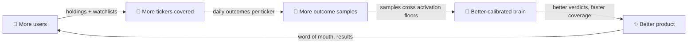

# 🔧 Scaling Blueprints: Designing the Grey Areas

> Companion to [SCALING_VISION.md](SCALING_VISION.md). That doc says **what** and **why**;
> this doc says **how**. Five designs: the four M1 building blocks, plus the learning-layer
> "constitution" that keeps human bias out of the brain — and the concrete playbook for the
> data-network-effect flywheel.
>
> Status: **design, not yet built.** M0 (auth, narrator cache, chat quotas) comes first —
> see `docs/superpowers/specs/2026-07-26-m0-multi-user-foundation-design.md`.

---

## Blueprint 1 — Dynamic Universe 🌌

**Problem:** today the analyzed universe is a hand-edited `data/managed_tickers.json`.
With many users, the universe must *become* the union of what users actually hold and
watch — without the LLM bill running away.

**Good news:** the machinery half-exists. Ticker entries already carry
`origin: "held"`, `cadence: "daily"`, `promoted_at` (written by `core/portfolio/promotion.py`
when a held stock gets promoted into coverage). We extend this, we don't replace it.

### Design

**Extended ticker record** (additive fields, backward compatible):

```jsonc
{
  "sym": "TCS",
  "name": "Tata Consultancy Services Limited",
  "sector": "it_sector",
  "enabled": true,
  "origin": "held",            // seed | held | watched | discovery | on_demand
  "cadence": "daily",          // daily | weekly | on_demand
  "promoted_at": "2026-07-10",
  "holders": 41,               // NEW: # users holding it
  "watchers": 133,             // NEW: # users watching it
  "chat_hits_7d": 12,          // NEW: chat questions mentioning it, last 7 days
  "last_analyzed": "2026-07-25"
}
```

**Universe Service** (nightly job, runs in the intelligence plane):

1. Recompute the union: all users' holdings ∪ watchlists ∪ discovery-shelf actives.
2. Score each ticker's **demand**: `demand = 3×holders + 1×watchers + 0.5×chat_hits_7d`
   (weights in `config.yaml`, not code).
3. Assign cadence tiers:
   - **daily** — any *held* ticker, plus top-N by demand (N = daily analysis budget).
   - **weekly** — watched long tail.
   - **on_demand** — everything else; analyzed on first request, then cached.
4. **Budget governor:** `MAX_DAILY_ANALYSES` cap in config. If held tickers alone exceed
   the cap, lowest-demand tickers demote to weekly and an ops alert fires. Alert at 80%
   budget so growth is visible before it pinches.

**On-demand path (the amortization moment):** a user adds an uncovered ticker →
one first-look analysis is enqueued (debounced: max once per ticker per day) → the verdict
lands in the shared store → the ticker enters the weekly tier. The *next* user who adds it
pays nothing. This is the network effect in its smallest unit.

**Staleness honesty rule:** every surface that shows a verdict (brief, chat, card) must
show its age. A weekly-tier verdict says "analyzed 4 days ago" — never pretend freshness.

### What this replaces
Nothing is deleted. `promotion.py`'s held-ticker promotion becomes one input among three
(held / watched / demand). The scheduler keeps reading the same file.

---

## Blueprint 2 — Delivery Worker 📬

**Problem:** brief/push/email fan-out currently runs inside the API/scheduler process,
inline, user by user. At 1,000 users, an 08:50 IST brief means ~1,000 renders + pushes
competing with live API traffic — and one slow SMTP call delays everyone behind it.

### Design — the Outbox pattern

```
scheduler (brief ready)            worker loop (separate process)
        │                                   │
        ▼                                   ▼
  INSERT INTO outbox  ──────────►  SELECT … WHERE status='queued'
  (user_id, channel,               ORDER BY priority LIMIT 100
   payload_ref,                    → render + send (batch of 100)
   dedupe_key,                     → status='delivered' | retry n≤3
   status='queued')                → backoff 1m/5m/30m on failure
```

- **Outbox table** (SQLite at M0-scale, Postgres at M1): `id, user_id, channel
  (push|email), kind (brief|digest|weekly|alert), payload_ref, dedupe_key, status,
  attempts, created_at, delivered_at`.
- **Idempotency:** `dedupe_key = user_id + kind + date`. Re-enqueueing the same brief is a
  no-op. A crashed worker restarts and resumes safely — no double sends, ever.
- **Enqueue is instant** (~1ms/user); the scheduler's brief job finishes in seconds
  regardless of user count. Delivery happens at the worker's pace.
- **Failure isolation per user:** one dead push subscription can't block anyone else.
  Existing Wave-A machinery (sent-log-after-outcome, delivered-flag retry, 400/403
  subscription pruning) moves *into* the worker unchanged — it was built for this.
- **Payloads are references, not blobs:** `payload_ref` points at the shared verdict/brief
  data; the worker renders template + user numbers at send time. The outbox stays tiny.
- **Metrics** (→ `/scheduler/status`): queue depth, oldest-queued age (delivery lag),
  per-channel failure rate. Alert when lag > 15 min.

**Deployment shape:** at M0 nothing changes. At M1 the worker is a second Railway service
(same image, different start command) sharing the database — the first true service split,
and deliberately the *easiest* one.

> **✅ Implemented — Atlas C7 (`core/delivery/outbox.py`), dormant behind `ATLAS_ENABLED`.**
> The outbox table lives in `data/atlas.db`; `deliver()` is the single choke point that
> enqueues per-channel rows when the flag is on (else today's inline send). As-built
> deviations from the sketch above, all deliberate:
> - **In-process drainer, not a second service** (spec §8 defers the service split to M2):
>   the drainer runs **only in the singleton-lock owner** — the same guard that already
>   makes the scheduler single-owner under `--workers 2` — and claims each row with a CAS
>   (`status='queued'→'sending'`, act iff `rowcount==1`, reviewer R3) so there is no
>   double-send even without a separate process.
> - **Payload stored inline** as compact JSON `{title,body,url}` in `payload_ref` (owner
>   decision) rather than a reference — push bodies are already capped and C9 prunes the rows,
>   so they stay tiny.
> - **`dedupe_key = user_id|kind|date|content-hash|channel`** — the content hash lets an
>   identical re-run dedupe while two distinct alert bundles the same day each deliver.
> Backoff/dead-letter caps via `cfg("delivery.outbox_{max_attempts,backoff_minutes}")`.

---

## Blueprint 3 — Semantic Chat Cache 💬

**Problem:** chat is the only unbounded per-user LLM cost (audit AUD-101: worst case ~30
LLM calls in one turn). Most questions are variations of the same few intents. The design
goal: **common questions cost zero; only genuinely novel questions hit the model.**

### Design — the Answer Ladder

Every message descends the ladder and stops at the first rung that can answer:

| Rung | What | LLM cost | Expected share |
|---|---|---|---|
| **L0 — Verdict card** | Message resolves to *ticker + standard intent* ("what do you think of TCS?", "should I buy Maruti?") via the existing NSE-first symbol resolver + a small intent pattern list → serve today's cached verdict card directly | **zero** | ~50%+ |
| **L1 — Semantic cache** | Embed the normalized question; cosine ≥ threshold (~0.92, tuned) against today's answered-questions cache → serve the cached answer, marked "⚡ instant" | one embedding call (~free) | ~20% |
| **L2 — Full agentic loop** | Everything else → existing `/ui/chat/stream` tool loop, then **write the (embedding, answer) pair back into the L1 cache** | full | ~30% |

**Cache keying & invalidation:** cache entries are keyed
`(trading_date, ticker_set, intent)`. The whole cache expires at the next verdict refresh
(16:35 IST) — a cached answer can never outlive the analysis it was based on.

**The three safety rules (non-negotiable):**
1. **Never cache user-specific answers.** Any answer that read the user's portfolio,
   quota, or session context is L2-only and never enters the shared cache. (Cross-tenant
   leak prevention — see [LEGAL_AND_COMPLIANCE.md](LEGAL_AND_COMPLIANCE.md).)
2. **Strip user context before embedding.** The embedded text is the normalized question
   only — no holdings, no numbers, no names.
3. **Cached answers are labeled.** The user always knows they got the shared card vs. a
   live analysis. Trust is a feature.

**Plus: provider prompt caching.** Restructure the chat system prompt so the large stable
prefix (instructions, tool definitions) is byte-identical across calls, enabling
OpenRouter/provider prompt-cache discounts on input tokens. Measure the hit rate via
telemetry — if a provider doesn't honor it, the restructure still costs nothing.

**Staleness & context-specificity rules** (why a cached answer can never be *wrong-day*
or *wrong-purpose*):

1. **Date is part of the key, and expiry is event-driven, not just time-driven.** Every
   entry carries `trading_date`; the whole cache dies at the next verdict refresh
   (16:35 IST). Additionally, *mid-day* events evict early: a shock re-forecast (Living
   Envelope) or a breaking alert on a ticker immediately evicts every cached entry
   touching that ticker. A cached answer can never outlive the analysis underneath it.
2. **Temporal intent survives normalization.** "Should I buy TCS *today*?" and
   "*long-term* view on TCS?" are different intents — the intent taxonomy includes
   horizon (intraday / short / long), so they key differently and never collide.
3. **Purpose/persona qualifiers = distinct intents.** "…for a conservative investor"
   keys separately. Rare phrasings simply miss the cache and fall through to L2.
4. **The failure asymmetry is deliberate:** a cache *miss* costs a few paise of LLM;
   a false *hit* costs trust. Keying and the similarity threshold are tuned so misses
   absorb all the ambiguity — when in doubt, go to L2.

**Quota interacts with the ladder:** L0/L1 answers don't consume quota (they're free to
serve); only L2 does. Free-tier users get generous cached answers and a bounded number of
live analyses — which is exactly the right product shape anyway.

---

## Blueprint 4 — Per-User Cost Telemetry 📊

**Problem:** `data/telemetry.db` (`llm_calls` table) records every LLM call with
per-model cost rates (Wave D) — but no `user_id`. Until cost-per-user is a number we can
chart, unit economics are faith, not fact.

### Design

1. **Additive schema migration:** `ALTER TABLE llm_calls ADD COLUMN user_id TEXT` —
   nullable, so all existing rows and writers keep working untouched.
2. **A `contextvar`, not a signature change:** `record_llm_call()` has ~20+ call sites.
   Instead of threading `user_id` through every one, auth middleware (and the chat routes)
   set `current_user_id: ContextVar[str | None]` at request start; `record_llm_call()`
   reads it automatically. Scheduled/shared work never sets it → logs `NULL`.
3. **The attribution rule:** `user_id = NULL` **means "shared brain"** — scheduled
   analysis, ingestion, discovery. Only genuinely per-user work (chat, on-demand
   `/analyse`, narrator until it's cached) carries a user_id. This split *is* the
   cost model made measurable: the NULL bucket should be flat as users grow; the
   per-user bucket should be small and quota-bounded. If either drifts, the
   architecture is leaking.
4. **Reporting:** nightly roll-up → `cost_by_user_day` (date, user_id, calls, tokens,
   cost ₹/$). Surfaced two ways: a line in the weekly ops digest ("top-5 users by cost,
   shared-brain %"), and a `/scheduler/status` field for dashboards. Alert if any single
   user exceeds a configurable daily cost ceiling (abuse tripwire).

> **✅ Implemented — Atlas C8 (`services/data/stores/log_store.py`), dormant behind `ATLAS_ENABLED`.**
> Points 1–4 built as designed: nullable `llm_calls.user_id` (ALTER + fresh-schema);
> `current_user_id` ContextVar set by the **auth dependency** (`auth._attribute_telemetry` in
> `get_current_user_optional`, only when the flag is on) — no signature change at the ~20 call
> sites; NULL = shared brain (scheduled work never sets it); `cost_by_user_day` rebuilt nightly
> by **scheduler Job 18** (`rollup_cost_by_user_day`, NULL kept as the shared-brain bucket).
> **Still design-only:** the weekly-digest "top-5 users" line, the `/scheduler/status` surface,
> and the per-user daily cost-ceiling tripwire (the rollup table they read now exists).

---

## Blueprint 5 — The Learning Constitution ⚖️
### Market truth vs. human signal — the division that keeps the brain honest

This is the design behind the sentence *"human feedback is auxiliary signal only, never
the reward."* It deserves precision, because getting it wrong quietly poisons the brain.

### Why the division exists (the one paragraph of theory)

Market outcomes are **unbiased labels**: the closing price doesn't care what anyone hoped.
Human trading behavior is **systematically biased**: people refuse to realize losses
(disposition effect), chase what just went up (recency), and copy each other (herding).
A learner rewarded on human agreement learns to *flatter humans*. A learner rewarded on
market outcomes learns *markets* — and human signals become useful **inputs** it can
weigh, rather than a **target** it must please.

### The Feedback Event (new, append-only)

```jsonc
{
  "ts": "2026-08-03T11:02:00+05:30",
  "user_id": "u_1234",
  "symbol": "RELIANCE",
  "advice_id": "adv_2026-08-03_RELIANCE_u1234",
  "verdict_shown": "TRIM",
  "action": "overridden",        // accepted | overridden | ignored
  "override_direction": "HOLD",  // what the user did instead
  "position_state": "losing"     // winning | losing — for bias auditing
}
```

Captured when a user acts on (or dismisses) an advice card. Stored append-only,
tenant-scoped, in the user plane — **physically outside the RL stores**.

> **✅ Implemented — Atlas C8, dormant behind `ATLAS_ENABLED`.** The event is the
> `feedback_events` table in `data/atlas.db` (append-only, FK to `users`, DPDP-cascades on
> delete). `atlas_store.record_feedback_event` writes it; `POST /ui/feedback` captures the
> accept/override/ignore from the session user. **R1** is enforced by the real import-boundary
> guard `tests/unit/test_atlas_import_boundary.py` (created in Atlas C2 — the blueprint had only
> *prescribed* it); the feedback store lives in `atlas_store`, which `core/intelligence/**` may
> not import. **R3** is `atlas_store.feedback_aggregate()`, which returns nothing below
> `cfg("atlas.feedback.aggregation_floor_users", 20)`. **Still design-only:** wiring aggregates
> into Blueprint-1 demand (R2), the quarterly disposition-bias audit (R4), and the advice-card
> accept/override **frontend control** (the endpoint contract ships; the UI is a visual-pass item).

### The four consumption rules

| Rule | Statement | Enforced how |
|---|---|---|
| **R1 — Reward isolation** | Scorecards, duels, envelopes, regime multipliers update from market outcomes **only**. No code path reads feedback events inside `core/intelligence/rl/`. | Import-boundary check in tests: `core/intelligence/rl/` must not import the feedback store |
| **R2 — Aggregates as features, decisions by humans** | Feedback *aggregates* (per-rule override rate, per-ticker acceptance) may: rank the universe (Blueprint 1's demand score), populate trust dashboards, and **flag rules for human review** ("80% of users override `trim_profit_confidence_decline` — is it miscalibrated?"). They may **not** auto-adjust any weight, threshold, or multiplier. | Aggregates land in reports, never in config |
| **R3 — Aggregation floor** | No feedback aggregate is consumed anywhere until ≥ 20 distinct users contribute to it. Below the floor it's one person's psychology, not signal — and it's a privacy boundary (no aggregate can be traced to an individual). | Floor constant in config; aggregator refuses below it |
| **R4 — Standing bias audit** | Quarterly: compare override rates on losing vs. winning positions. Disposition effect predicts users override SELL/TRIM far more on losers. Publish the number — it calibrates how much (little) to trust the feedback stream, and it's a fascinating product metric in its own right | Scheduled report, same lane as the scorecard email |

### What feedback IS allowed to do (so it's not wasted)

- **Prioritize:** high-override rules get human design review first.
- **Rank:** feedback flows into universe demand (Blueprint 1) and roadmap decisions.
- **Explain:** "of users shown this verdict, 72% acted on it" is a legitimate,
  powerful trust cue on the card itself (once past the R3 floor).
- **Eventually — as a feature, with evidence:** if, after the learning loop is proven,
  an offline experiment shows aggregate-acceptance-rate has predictive value *against
  market outcomes*, it may enter the advisor as one more input feature. It earns its way
  in through the same shadow-lane evidence bar as everything else. It never becomes
  the reward.

---

## Blueprint 6 — The Data-Network-Effect Playbook 🔁
### "I love this concept — so what do we do?"

A network effect you don't measure is a slogan. Here's the flywheel with every edge
instrumented, so we can *watch* it spin (or catch it stalling):



### The instrument panel — Brain Maturity metrics

One place (extend the existing scorecard report + a `/rl/maturity` style status field)
reporting, weekly:

| Metric | Definition | Why it matters |
|---|---|---|
| **Coverage** | # tickers in daily/weekly tiers ÷ target universe | Edge U→C: is user growth actually widening coverage? |
| **Learning velocity** | New (ticker, date, outcome) rows per week | Edge C→O: the single KPI user growth must move. If users double and velocity doesn't, the flywheel is broken at this edge |
| **Sample depth per cell** | Outcome count per (sector) and per (agent, regime) cell | Edge O→L: cells below their activation floor are *not yet learnable* — this is the honest map of what the brain knows vs. guesses |
| **Calibration score** | Envelope hit-rate vs. stated confidence, per sector | Edge O→L: are more samples actually improving calibration? |
| **Verdict lift** | Adapted vs. baseline lane P&L (the shadow-lane measure) | Edge L→P: the only metric that ultimately matters |

### Activation floors (samples before trust)

The learning-evidence review's core finding was *insufficient sample* — so make
sufficiency explicit and mechanical:

- Per-sector thresholds: activate only at **≥ 30 outcomes** in that sector.
- Regime × agent multiplier updates: reviewed only at **≥ 50 outcomes** per cell
  (feeds the Wave-I `regime_agent_hit_rates` review).
- Below floor → the cell uses global defaults and is *labeled* immature in the
  maturity report.

Floors turn "more users" into a visible countdown: *"Pharma sector: 22/30 outcomes —
8 more days of coverage until per-sector calibration activates."* That sentence is the
network effect made tangible — for us **and** as user-facing product copy.

### The brain's memory budget — why years of data don't blow up token cost 🧮

A fair worry: "training on years of history must eventually mean huge LLM contexts."
It doesn't — because of a structural choice already in place: **the brain learns in
compact statistics, not in LLM context.**

- Scorecards, duels, regime multipliers, envelopes = *counters and parameters*. A year
  of outcomes updates the same fixed-size numbers; ten years updates the same numbers.
  Learning state does not grow with history.
- LLM calls never receive raw history. They receive the **distilled** context: the
  ticker dossier summary, the last 3 days of news (the Wave-G filter), today's
  indicators, the regime label. Token cost per call is **flat over time by construction**.
- Chat memory is windowed (12 messages) and sessions expire — no unbounded growth there
  either.

Two pieces are *not yet designed* (flagged honestly, neither is urgent):

1. **Dossier compaction.** Per-ticker dossiers append episodes; after ~a year they need
   a summarize-and-prune policy — keep the last N episodes verbatim + a rolling LLM
   summary of everything older (one cheap call per ticker per quarter). Schedule this
   before the oldest dossiers pass ~12 months.
2. **Episodic retrieval on a budget.** Someday: "find the 3 most similar past episodes
   to today's setup" (the RAG substrate under `core/intelligence/` is the natural home).
   When built, it gets a **fixed token budget per call** (top-k, hard cap) — retrieval
   augments the distilled context, never replaces the compact-statistics learning.

### The ignition sequence (ordering discipline)

1. **Prove** — the 2026-07-31 shadow-lane hard-bind decision: does the learned lane add
   lift on one brain? Until yes, network effects multiply *noise*.
2. **Instrument** — ship the maturity panel (it's cheap: counts over stores we already have).
3. **Ignite** — grow users; watch learning velocity respond; celebrate activation floors
   as they trip, sector by sector.
4. **Compound** — as cells activate, verdicts sharpen where users actually are —
   which recruits users — which is the loop.

---

## Build order & dependencies

```
M0 (now): auth · narrator cache · chat quotas · SCHEDULER_KEY on
   └─► Blueprint 4 (telemetry user_id) — needs auth's user identity; build early in M1,
        it validates everything else
        └─► Blueprint 3 (chat cache) — needs quota plumbing from M0
        └─► Blueprint 1 (dynamic universe) — needs watchlists per user
        └─► Blueprint 2 (delivery worker) — needed when fan-out latency hurts (~100+ users)
Blueprint 5 (feedback events) — schema ships whenever advice cards get accept/override UI
Blueprint 6 (maturity panel) — anytime; before user growth, ideally. Cheap and clarifying.
```

*Written 2026-07-26. Companion docs: [SCALING_VISION.md](SCALING_VISION.md) (the why),
[LEGAL_AND_COMPLIANCE.md](LEGAL_AND_COMPLIANCE.md) (the guardrails), and the M0 spec under
`docs/superpowers/specs/`.*
