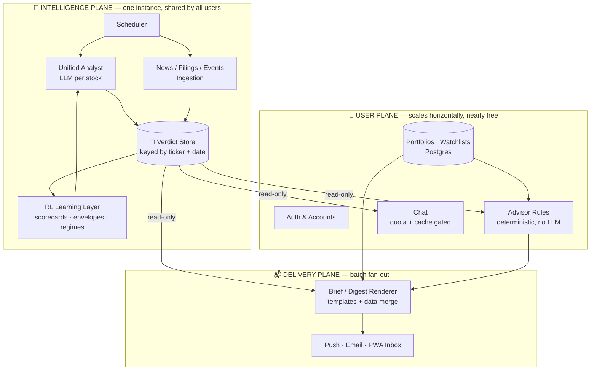

# 🚀 Scaling Vision: One Brain, A Million Portfolios

> **How StockAgent grows from 1 user to 1 million — without the bill growing with it.**
>
> Audience: everyone. New developers, business analysts, and anyone technical-adjacent
> should be able to read this top to bottom and understand both the *business case*
> and the *engineering plan*.
>
> **Companion documents:** [SCALING_BLUEPRINTS.md](SCALING_BLUEPRINTS.md) (detailed
> designs for the M1 building blocks + the learning constitution) ·
> [LEGAL_AND_COMPLIANCE.md](LEGAL_AND_COMPLIANCE.md) (SEBI, DPDP, multi-tenancy gates) ·
> M0 spec & plan under `docs/superpowers/specs/` and `docs/superpowers/plans/`
> (dated 2026-07-26).

---

## TL;DR (read just this if you're busy)

1. **Our costs scale with the number of *stocks* we analyze, not the number of *users* we serve.**
   Analyzing RELIANCE today costs the same whether 1 person or 1 million people read the result.
2. **The architecture is already ~80% right.** The expensive "analysis" side is keyed by stock
   ticker; the cheap "portfolio" side is already keyed by user. We harden that boundary — we
   don't rewrite the product.
3. **Two cost leaks must be plugged** (places where per-user code calls an LLM for what is
   really a per-stock fact): the advice narrator and unbounded chat.
4. **The learning system is already centralized by design.** It learns from *market outcomes*
   (did the stock go up or down?), not from any individual user. More users → more stock
   coverage → faster learning → better for **everyone**. That's a genuine data network effect.
5. **Golden rule of the whole plan:**
   > *Verdicts are facts about stocks. Portfolios are facts about users.
   > No per-user code path may ever call an LLM for a per-stock fact.*

---

## 1. The Big Idea: Analysis Is a Public Good 🌦️

Think of a **weather station**. Forecasting tomorrow's weather in Mumbai costs the same
whether 10 people or 10 million people check the forecast. The expensive part — satellites,
models, meteorologists — is done **once**. Distribution is nearly free.

StockAgent is the same shape:

| The expensive part (done once per stock, per day) | The cheap part (done per user) |
|---|---|
| LLM analysis of each stock (the "unified analyst") | Applying rules to *your* holdings |
| News & filings ingestion (Serper, NSE) | Rendering *your* morning brief |
| Event calendars, price envelopes | Sending *your* push notification |
| RL learning: scorecards, regime stats | Storing *your* transactions |

The left column is a fact about **RELIANCE**. The right column is a fact about **you**.
The left column costs real money (LLM tokens, API calls). The right column costs
fractions of a paisa (database rows, templates, free push notifications).

**The entire scaling strategy is: never let the right column accidentally do the left column's work.**

---

## 2. The Cost Math (why this is a great business) 💰

Today's measured spend (from our Phase-5 cost audit): roughly **$2/month for 16 stocks**
of daily deep analysis, on cost-optimized LLM tiers. Extrapolating:

| Stock universe covered | Analysis cost / month | Number of users it serves |
|---|---|---|
| 16 stocks (today) | ~$2 | **unlimited** |
| Nifty 100 | ~$13 | **unlimited** |
| Nifty 500 | ~$60–70 | **unlimited** |

The punchline table — **cost per user of the entire intelligence layer**:

| Users | Intelligence cost per user / month (Nifty 500) |
|---|---|
| 100 | ~$0.70 |
| 1,000 | ~$0.07 |
| 100,000 | ~$0.0007 |
| 1,000,000 | ~$0.00007 |

The ceiling is the stock market itself: NSE has ~2,000 listed companies, and realistically
~500 are worth covering. **Intelligence cost is bounded forever, no matter how many users
sign up.** Unit economics improve *monotonically* with every new user. Very few products
get to say that.

What's left as genuinely per-user cost? Push notifications (free via FCM), email
(near-free), database rows (pennies) — and **chat**, which is the one per-user LLM cost
we can't eliminate. So chat becomes the *metering point*: free tier gets quotas and
cached answers, paid tier gets the full conversational analyst. The cost structure
hands us the business model.

### The pricing model (decided 2026-07-26) 💳

Freemium with a hard-metered paid tier — paywall exactly what costs money, give away
what's free to serve:

| | **Free** (the network-effect engine) | **Pro** (the meter) |
|---|---|---|
| Morning brief + verdict cards on the covered universe | ✅ | ✅ |
| Watchlist (feeds coverage — we *want* this used) | ✅ | ✅ |
| Cached chat answers (L0/L1 — verdict cards, common questions) | ✅ unlimited | ✅ unlimited |
| Live analyst chat (L2 — real LLM turns) | ~5/day | high cap |
| On-demand deep analysis of any ticker | — | ✅ |
| Full advisor depth on your portfolio | limited | ✅ |
| Priority daily coverage of your holdings | — | ✅ |

- **Never paywall briefs/verdicts:** marginal cost ≈ zero, and free users are the
  coverage-and-feedback engine that makes the brain better (§6). Charging for them
  would starve the flywheel to protect nothing.
- **Founding-member price** for the first paid cohort (locked-in discount) — early
  users are doing us a favor: they're growing the brain.
- **Sequence:** friends free (M0) → free public beta with quotas (build coverage +
  maturity metrics) → introduce Pro **only after** the SEBI registration question is
  resolved — payment triggers the "consideration" prong
  ([LEGAL_AND_COMPLIANCE.md](LEGAL_AND_COMPLIANCE.md) §1). Legal gate before revenue,
  always.

---

## 3. The Two Cost Leaks 🔧 (and their fixes)

These are the only two places today where per-user code burns LLM tokens:

### Leak 1 — The Narrator (`core/portfolio/narrator.py`)
Today it calls the LLM **per user, per holding** to phrase advice into a sentence.
But *"TRIM RELIANCE — RSI stretched, results Thursday"* is the **same sentence** for
every user holding RELIANCE with a TRIM verdict.

- At 1,000 users × 15 holdings = **15,000 LLM calls/day** for ~500 distinct sentences. 😱
- **Fix:** narrate once per `(ticker, verdict, date)`, cache it, and merge the
  user-specific numbers (your quantity, your P&L) with a plain template.
  Turns `O(users × holdings)` into `O(tickers)`.

### Leak 2 — Chat (unbounded per-user LLM)
Our own audit (AUD-101) measured a worst case of ~30 LLM calls in a single chat turn.
Unbounded per-user LLM is the one thing that could wreck the cost model.

- **Fix (three layers):**
  1. **Per-user quotas** — free tier gets N messages/day.
  2. **Semantic cache** — "What do you think of TCS?" should serve today's already-computed
     verdict card with **zero** LLM calls. Only genuinely novel questions hit the model.
  3. **Prompt caching** — the shared system prompt is cached at the provider, slashing
     input-token cost on every call.

---

## 4. Target Architecture: Three Planes ✈️

**The one interface that matters:** the **Verdict Store** — a versioned, dated record per
`(ticker, date)` containing: verdict, confidence, price envelope, rationale, sector, regime,
and the narrated one-liner. It is the brain's *only* output, and the user plane's *only*
input. The user plane **reads** verdicts; it never triggers analysis.

| Plane | Scales with | Cost driver | Needs horizontal scaling? |
|---|---|---|---|
| 🧠 Intelligence | # of stocks × frequency | LLM + data APIs | **Never** (bounded by NSE universe) |
| 👤 User | # of users | DB rows, CPU | Yes — but it's cheap rule evaluation |
| 📬 Delivery | # of users | Push/email fan-out | Yes — queue workers, batchable |

Good news: this is largely formalizing what exists. The portfolio layer is *already*
multi-user shaped (`PortfolioStore(user_id=...)`, `list_user_ids()` loops in the pipeline
and brief builders). We're hardening a boundary, not performing surgery.

---

## 5. The Roadmap: M0 → M1 → M2 🗺️

### M0 — "Friends & Family" (1 → 10 users) · *weeks of work, no infra change*
| # | What | Why |
|---|---|---|
| 1 | **Turn auth on** (currently on hold) + activate scheduler-key enforcement | Hard prerequisite for user #2 |
| 2 | **Postgres for the user plane** (users, portfolios, transactions, watchlists, chat sessions) | File-per-user doesn't survive concurrency |
| 3 | **Narrator caching** by `(ticker, verdict, date)` | Kills Leak 1 |
| 4 | **Chat quotas** per user | Kills Leak 2's tail risk |

💸 *Running cost after M0: ~$5/month. Yes, really.*

### M1 — "Real Product" (10 → 1,000 users)
| # | What | Why |
|---|---|---|
| 1 | **Dynamic universe**: analyzed stocks = union of everyone's holdings + watchlists, with coverage tiers (popular stocks daily, long tail weekly / on-demand) | One user adds a new stock → one analysis → cached for everyone. Costs amortize automatically |
| 2 | **Delivery worker**: brief/push fan-out moves to a queue-fed background worker | API stays snappy while notifications fan out |
| 3 | **Semantic chat cache** + provider prompt caching | Common questions cost zero |
| 4 | **Per-user cost telemetry** (`user_id` on every cost row) | Proves the unit economics with data, not faith |
| 5 | Billing / paid chat tier (optional) | The cost structure already drew the free/paid line for us |

💸 *Running cost: ~$50–150/month total — dominated by universe size, **not** user count.*

### M2 — "Scale" (1,000 → 1,000,000 users)
- Split into services: intelligence / API / delivery workers.
- Postgres read replicas for the user plane.
- **Briefs become static JSON at the edge**: the PWA renders the brief client-side, so
  delivering a brief to a million users is a cached CDN fetch, not a million server renders.
- Chat is the revenue line.
- **The intelligence plane does not change at all.** That's the whole point.

---

## 6. The Learning Vision: A Brain That Compounds 🧠✨

Here's the genuinely exciting part.

**Our RL layer is already centralized by construction.** The scorecards, agent duels,
price envelopes, and regime multipliers all learn from **market outcomes** — did the
stock actually go up? — keyed by `(ticker, agent, regime)`. The ground truth is the
closing price. No individual user appears anywhere in the reward loop.

That means *"one brain, many portfolios"* isn't a redesign. It's the natural shape of
what's already built. What do more users add? Four compounding network effects, ranked:

1. **📈 Coverage expansion (the big one — and it's automatic).** Every user's stocks
   join the analyzed universe → more (stock, outcome) pairs land every single day →
   dossiers, sector thresholds, and regime hit-rates mature faster. Our learning-evidence
   review flagged "insufficient sample size" as the #1 limiter — **user growth is
   literally the cure.**
2. **🔬 Cohort evaluation.** 1,000 portfolios consuming one brain = 1,000 out-of-sample
   evaluations of the same verdicts under different entry prices and constraints.
   Vastly better statistical power than one portfolio's positions.
3. **🙋 Human feedback stream.** Users accepting/overriding advice creates a labeled
   preference stream. **Critical guardrail:** this is *auxiliary signal only, never the
   reward*. Retail behavior is systematically biased (people refuse to sell their losers —
   the "disposition effect"). If user actions became labels, the brain would learn human
   bias instead of markets. Market outcomes stay the sole ground truth. 🚫
4. **👀 Attention signal.** Watchlist adds and chat queries tell us which stocks deserve
   deep coverage — a demand-weighted priority queue for the analyst.

This is the same structural moat as **Tesla's fleet learning** (every car's miles improve
every car's autopilot) or **Google search** (every query improves ranking for everyone):
a **data-network-effect learning system**. Every user makes the product better for every
other user — and none of them had to do anything but use it.

### The honest caveat 🧪
Our own Learning Evidence review found the learning layer **has not yet demonstrated
positive lift** (run 1: learning-inert; run 2: small adverse sample, credit-assignment
degeneracy, LLM overriding the learned threshold in ~36% of shadow rows). Scaling a
learner that isn't learning multiplies noise, not intelligence. So the sequence is:

> **Prove the learning loop on one brain (shadow-lane hard-bind decision) →
> then let user growth make it compound.**

That ordering is what turns the vision from a hope into a credible pitch.

---

## 7. Before Public Launch: Two Non-Engineering Items ⚖️

1. **SEBI / regulatory.** One user = personal research tool. Strangers receiving
   buy/sell recommendations in India enters investment-adviser territory (SEBI RIA/RA
   regulations). Our "labelled research, not advice" framing helps, and friends-scale
   is one thing — but **before public signups this needs a proper review**. Flagged,
   not lawyered.
2. **Security posture.** Multi-tenancy raises the stakes: per-user data isolation,
   auth enforcement (currently dormant), and secrets hygiene in a public repo.

---

## 8. Glossary (for the non-quant reader) 📖

| Term | Plain-English meaning |
|---|---|
| **Verdict** | The system's daily conclusion for one stock: BUY / SELL / HOLD-flavored signal with confidence and reasoning |
| **Verdict Store** | The shared "forecast board" — one entry per stock per day, read by everything user-facing |
| **LLM tiers** | Cheap/fast models for bulk work, stronger models for hard reasoning — right tool per job |
| **RL layer** | The part that keeps score: which analysis agents are right, in which market conditions, and adjusts trust accordingly |
| **Regime** | The market's current "mood" (trending, choppy, fearful…) — agent trust varies by regime |
| **Shadow lane** | A parallel track where the learned system makes predictions that are *recorded but not acted on* — how we prove learning works before trusting it |
| **Fan-out** | Sending one piece of content to many users (notifications, emails) |
| **Semantic cache** | Recognizing that two differently-worded questions mean the same thing, and reusing the answer |

---

## The One-Sentence Summary

> **Verdicts are facts about stocks; portfolios are facts about users. Keep the expensive
> brain shared and bounded, keep the per-user layer cheap and dumb, gate chat — and the
> product gets *cheaper per user and smarter for everyone* with every single signup.** 🎯
