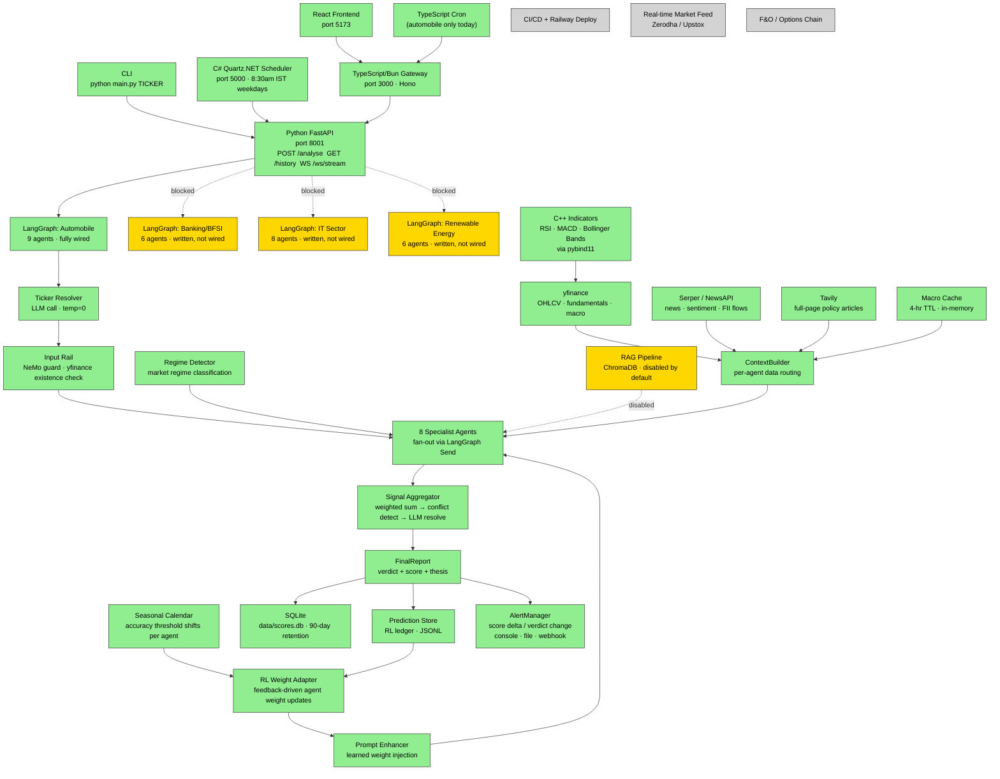

# Architecture Overview

> System as it exists on 2026-05-05.
> Update this diagram whenever a component graduates from planned → in-progress → built,
> or whenever a new component is added.

---

## Component status legend

| Color | Meaning |
|-------|---------|
| Green | Built and wired end-to-end |
| Gold | Written but not yet wired (in-progress / blocked) |
| Grey | Planned — not started |

---

## System diagram



---

## Port map

| Service | Port | Status |
|---------|------|--------|
| Python FastAPI | 8001 | Built |
| TypeScript/Bun Gateway | 3000 | Built |
| React Frontend (dev) | 5173 | Built |
| C# Quartz.NET Scheduler | 5000 | Built |
| LangGraph Studio (dev) | varies | Built |

---

## Cross-language contract

All language boundaries use **JSON over HTTP**. No shared memory across process boundaries.
C++ is the sole exception: it runs in-process via pybind11 and is loaded by the Python process directly.

```
React (5173) → Bun Gateway (3000) → FastAPI (8001) → LangGraph/Python agents
                                  ↗
C# Scheduler (5000) ────────────
```
