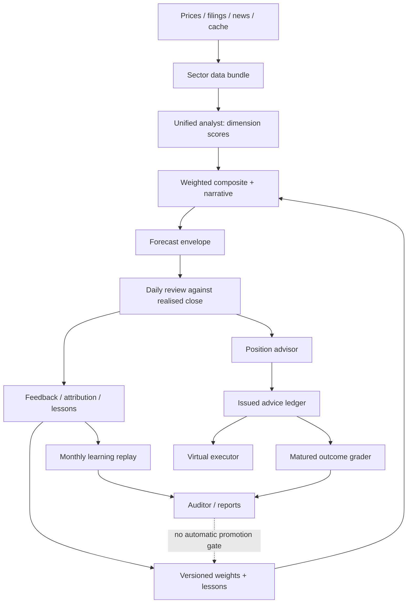

# Repository and production review — 2026-09-10

**Conclusion:** StockAgent has a working research product, durable adaptive state, and real retrospective evaluation. It has **not demonstrated that adaptation improves recommendations**. Several reward, timing, and sampling defects prevent its current learning statistics from establishing that claim. Production reliability also needs attention before adding more intelligence layers.

This is an engineering audit, not an assessment of whether to buy the stocks named in diagnostic examples.

## Scope and evidence

- **CODE:** inspected checkout and deployed commit `9a805878ed19c0cda7833d5b897ac05ee407436d`; production and local HEAD matched. Reviewed architecture/product/RL documents, the August three-loops PI, relevant source, tests, frontend, persistence and deployment configuration.
- **PROD:** bounded current Railway runtime logs; read-only SSH inspection of SQLite with `mode=ro` and `PRAGMA query_only=ON`; existing JSON/JSONL reports and state. Initial snapshots were taken on September 10 around 06:45–06:53 UTC. The latest completed daily review then was September 9, grading September 8. This was a current snapshot, not continuous monitoring or observation of September 10's later close.
- **LOCAL:** isolated tracked-file checkout without `.env`, test suite, source-extracted deterministic reproductions, and an isolated Chromium reproduction of the chat HTML issue. Source-extracted checks demonstrate the functions concerned; they do not replace full integration tests.
- **INFERRED:** risks following from code paths without a reproduced production incident are explicitly distinguished below.
- Production was inspected, not modified. No deployment, live job trigger, backfill, portfolio mutation, email, push, or model request was initiated by this audit. Existing scheduled jobs continued normally.
- Raw evidence and diagnostic helpers are local-only in `analysis_data/audit_20260910/` (git-ignored). This report intentionally omits credentials, user identifiers, balances, private payloads and the production endpoint.
- The existing untracked `docs/StockAgent-Three-Loops.pdf` could not be reliably extracted: its object streams/xref were corrupt and decompression failed. It was left untouched. The readable Markdown specification was used as the architecture source.

**Limits:** this is a deep trace of the critical paths, not an assertion that every line or every authenticated screen was exercised. Railway-managed backup availability, browser receipt of delivered push messages, all dependencies' vulnerabilities, and profitability after realistic execution costs were not established.

## What exists today

| Capability | Implementation and observed status |
|---|---|
| Sector-aware stock research | Four native sectors (automobile, banking/BFSI, IT, renewable energy) plus generic analysis. Unified analyst produces sector dimension scores; aggregator combines learned weights and narrative. Routing consolidation A1 is in the deployed code. |
| Data acquisition | Yahoo prices/fundamentals, NSE filings and official close checks, bhavcopy/parquet EOD cache, news/search, macro context, flows, corporate actions, surveillance, IPO feeds. Optional sources can degrade individually. |
| Adaptive state | Per-ticker forecast envelopes, feedback logs, weight versions, lessons, sector/market shared ledgers, dossier observations/questions, thesis review, regime/seasonal adjustments and shock reforecasting. Production has 38 weight-memory files, 19 updated in September; adaptation is active. |
| Forward envelopes | Month-start shaped forecasts, uncertainty bands, mid-cycle revision and archival. There are 90 envelope files in the inspected production tree; files and rows are not independent prediction samples. |
| Virtual portfolio | Deterministic position advisor, rule-driven virtual execution, cash/transaction ledgers, stop/profit protection, corporate-action handling, switch candidates, reconciliation and per-user persistence. No broker execution path was identified. |
| Discovery and IPO research | Weekly screen/deep-dive/shelf workflow, isolated paper lane, IPO calendar and demand/history analysis. Fresh runtime logs show IPO refresh, discovery-related work, and EOD synchronization. |
| Delivery | Stored morning briefs, weekly review, digest, notifications and an Atlas outbox with retries/dead letters. Push and email outcomes differ materially; see below. |
| Evaluation | Monthly agent/control/persistence/always-up scorecards, adapted/base/uniform replay, per-lesson associations, deterministic advice outcomes at 10/30/60 trading days, and switch evaluation. These are real implementations, with significant validity gaps. |
| Interface | FastAPI, WebSocket analysis, streaming tool-using chat, portfolio/inbox/analytics/RL monitor/prompt editor and an installable React PWA. Education and demo data are also present; these are not evidence of live learning. |
| Identity and tenancy | Bearer sessions, owner/member authorization, machine key, per-user portfolio files and Atlas relational indexes. Production `AUTH_REQUIRED=true`, machine key configured. Anonymous portfolio and scheduler status requests returned 401. Some intelligence read routes intentionally remain public. |
| Operations | In-process APScheduler, singleton ownership within a container, durable app/LLM/run/data-health logs, watchdog milestones, nightly local backups and attempted off-site email. |
| Optional/legacy | RAG and optional C++ indicator support; legacy per-dimension analysis fallback; dormant C# scheduler; compatibility import shims. Do not count optional code as active production behavior without checking flags. |

### Actual runtime shape

One Railway service, one replica, a persistent `/app/data` volume, and two Uvicorn workers. The background owner binds a local TCP port; it is **not** the file-lock singleton described in the older architecture prose. APScheduler and the outbox drainer run in that owner. A second worker serves requests.

Hard-bind is enabled in `config.yaml` (`rl.hard_bind_verdict_enabled: true`), so the older architecture's statement that the LLM verdict remains authoritative is stale. That closes one actuation gap, but introduces a separate timing problem in daily grading described below.

## Production evidence

| Observation | Measured result | What it establishes |
|---|---|---|
| Runtime and HTTP | Active deployment `SUCCESS`; root and `/health` returned 200 | Process/HTTP availability only. Railway deployment healthcheck path is unset; `/health` always returns `ok`. |
| Durable analysis records | 249 run summaries and 249 health records, August 26–September 9 | B1/B2 instrumentation is producing durable rows. It does not establish that health semantics are correct. |
| Recorded health | 239 `ok`, 10 `degraded`; `ok` rows contain 47 empty sections in total | Section failure/emptiness is not reflected correctly in the overall verdict. |
| Missing dimensions with actionable output | Included BUY with 1/6 and 2/6 dimensions, STRONG BUY with 3/9 | Partial data can still produce actionable classifications. These are analysis outputs, not proof a trade executed. |
| Ticker failure | September 9 TATAMOTORS Yahoo 404/no-data records correlate with analyses recorded `health=ok`, 9/9 dimensions | Provider failure is not a reliable abstention signal in the current analysis path. No successor mapping was assumed or changed. |
| Latest daily outcome | `produced=20`, `expected=20`, `pipeline_ok=true`; WELCORP simultaneously has `no_envelope`; 19 feedback rows exist for September 8 | Scheduler success currently counts returned failure statuses as successful output. |
| Delivery | Retained outbox: 57 email rows `dead`, 57 push rows `delivered` | Email delivery failure is established for this retained cohort. Push provider success does not prove a person read the message. |
| Email history | 246 failure records over 36 dates; 143 records since August 27 | Persistent transport problem, not just an isolated failed message. Counts are log rows, not unique notifications. |
| Backup | 34 `no off-site copy` records over 34 dates; 14 since August 27 | The app's nightly off-site email copy has repeatedly failed. Local archives still exist; provider-managed backups were not audited. |
| Atlas projections | `ticker_verdicts`: 0 rows. `user_advice`: 210, newest August 13. Authoritative JSONL advice: 300, newest September 8 | The relational advice projection is stale/incomplete; this does not mean advice stopped being issued. |
| Forecast/feedback metadata | 58 feedback-log files, 935 entries; every file's `sector` field says `automobile` | Sector grouping must use verified canonical identity, not this field. Mixed historical stores remain. |
| Old index incident | `^CNXAUTO` fingerprint: 78 records over August 25–27, none newer in durable logs | Do not describe it as a current outage. The cross-sector index coupling in code still exists. |
| Watchdog | Persisted pending/warning verification milestones and a critical hard-bind observation milestone | Notifications exist, but outstanding decisions have not been closed by evidence. |

Railway's JSON `level=error` appears even on application INFO success lines. The application's parsed severity and durable `app_logs.level` were used for failure analysis. Counting Railway's outer level alone would materially overstate errors.

### Does it evaluate its own suggestions?

**Yes, in several places. No, not yet in a scientifically reliable weekly/fortnightly improvement loop.**

1. **Daily:** evaluates an envelope row, emits LLM feedback, changes weights and lessons. It also supplies a three-window accuracy string to the feedback prompt. However, those windows are seven rows of the current cycle, and the same ensemble hit count is repeated under different agent names.
2. **Weekly:** a 28-calendar-day advice scoreboard considers calls at least five calendar days old. It uses latest prices, not fixed matured horizons, and only asks for prices of current holdings. Exited names can disappear from its denominator. It neither compares disjoint prior weeks nor drives a validated policy promotion.
3. **Monthly:** persisted scorecards compare against baselines and the previous month; a separate learning-evidence report compares adapted, frozen-base and uniform weights. This is real retrospective measurement. It is not a prospective controlled experiment of the whole learning stack.
4. **Nightly advice auditor:** actually grades matured advice, independent of the heuristic weekly scoreboard. Inspected outcomes include 255 advice rows at 10 trading days (107 correct), 135 at 30 days (52 correct), and 100 switch-rule rows at 10 days (69 correct). These have different meanings and overlapping samples; they must not be pooled into an investment success claim. No 60-day outcome cohort was present, explaining the headline `INSUFFICIENT_DATA`.
5. **Lessons:** fired/unfired associations are reported; there is no identified consumer that automatically promotes/retires lessons based on that report. An association with better outcomes is not causal evidence a lesson helped.

### What the stored learning reports actually say

| Existing report | Adapted hits | Frozen-base hits | Differing correctness outcomes | Stored conclusion |
|---|---:|---:|---|---|
| July | 120/335 (35.82%) | 113/335 (33.73%) | Adapted 15, base 8; reported p=0.21004 | `LEARNING_ACTIVE_UNPROVEN` |
| August | 102/259 (39.38%) | 102/259 (39.38%) | Adapted 7, base 7; reported p=1.0 | `LEARNING_ACTIVE_UNPROVEN` |

These are the reports' own residual-direction replay statistics, **not validated market-direction accuracy or profit forecasts**. “Divergence” here is actually differing correctness booleans, not necessarily every differing verdict. The July overall lift is 2.09 percentage points; the report's 30.43-point figure uses only the discordant subset and should not be presented as overall improvement.

The separate August scorecard records agent direction accuracy 24.71%, control 40.64%, and persistence 64.73%. It uses different lanes/cohorts from the weight replay. Reward defects, timing leakage, and unmatched sample sizes prevent interpreting those figures as a valid head-to-head estimate of predictive skill.

## Findings and technical gaps

Priority means remediation urgency: **P0** immediate security/correctness protection; **P1** next substantive work; **P2** maintainability/measurement improvement. Confirmed code behavior is not automatically a confirmed production exploit or financial loss.

### F01 — P0: executable HTML in chat output

**CODE + LOCAL reproduced.** `src/frontend/prototypes/sphere.jsx:138` returns `window.marked.parse(text)`; line 353 renders it through `dangerouslySetInnerHTML`. No HTML sanitizer exists on this path. An isolated Chromium check using the actual `renderMd` function and the loaded marked version executed a harmless image `onerror` handler. No production payload was injected.

`index.html` keeps bearer tokens in local/session storage. Therefore malicious model-supplied HTML has a plausible session-compromise path if it reaches the chat output. Fix the rendering boundary for streamed and completed text; restrict HTML and unsafe URLs; test the browser sink. An LLM instruction to avoid HTML is insufficient. **Story SA-001.**

### F02 — P0: wrong unit for the learner's direction reward

**CODE + LOCAL reproduced.** `daily_review.py:554` calls `classify_direction(actual_close, predicted_close)`. `feedback_agent.py:76` computes the residual relative to the forecast. A price rising 100→103 against a forecast of 108 is classified DOWN; BUY is marked wrong. Forecast error is useful, but it is not market direction.

This feeds direction accuracy, credit assignment, calibration and downstream explanations. Preserve legacy results as legacy; introduce explicitly versioned, horizon-aligned market-return labels. **SA-012–SA-016.**

### F03 — P0: post-outcome analysis is used to grade the past

**CODE; active configuration verified.** The September 9 job reviews September 8. `_run_todays_agent_scores()` runs `orchestrator.analyse(ticker)` with current data. With hard-bind enabled, `daily_review.py:602` replaces the graded verdict with that fresh report. The outcome being graded is already known. A current re-analysis can be explanatory, but cannot be credited as a prediction issued before that outcome.

The control lane has a related issue: `control_lane.py:119` predicts `next_trading_day(review_date)` during the following day's post-close job and writes `made_on=review_date`. That target session has normally already closed. Both lanes need actual issue timestamps and a future target cutoff. **SA-013/SA-014.**

### F04 — P1: per-agent credit mostly means “not blamed”

**CODE + LOCAL reproduced.** `weight_adapter.py:94` gives all agents credit on correct/no-fault days; otherwise everyone except the LLM's primary blamed agent gets credit. Opposite dimension scores receive identical credit if neither is named. The calibration blend then compares each score's lean with F02's residual label, with no substantive minimum beyond one calibration observation (`schemas/feedback.py:376`).

This makes chart-agent blame and market-window base rates influential. September weights show chart dimensions near or at zero in multiple stores, but **zero weights alone do not prove the adapter algorithm is broken**. Correct the reward and credit definition before tuning recovery constants. **SA-016/SA-021.**

### F05 — P1: misleading weekly agent comparison

**CODE + LOCAL reproduced.** Nested `_accuracy_trend` at `daily_review.py:861` never uses the agent when counting hits. It slices offsets 0/7/14 from only `load_feedback_log(cycle_id)`. Seven observations are not a calendar week, missing sessions alter boundaries, and month boundaries lose prior weeks. The reproduced bullish/bearish/neutral agents all displayed `4/7 → 3/7 → 4/7`.

Implement explicit disjoint weekly and 10-trading-session cohorts, cross-month loading, per-dimension targets and honest unavailable denominators. **SA-019.**

### F06 — P1: weekly scoreboard excludes exited advice

**CODE + LOCAL reproduced.** `core/delivery/weekly.py:179` builds its price request from current holdings. Later advice-loop rows without a current close are skipped. An empty current portfolio with one mature EXIT produces `counts.EXIT=1, checked=0`, even when an outcome price is available in principle. Variable evaluation ages and omitted HOLD semantics are additional mismatches with the nightly auditor.

Use the canonical matured-outcome ledger, retain exited/unpriceable calls explicitly, and compare equivalent horizons. **SA-019.**

### F07 — P0: health classification accepts fallback text and ignores lost sections

**CODE + PROD + LOCAL reproduced.** `_classify_section` in `bundle_builder.py:225` already handles blank text and exact `unavailable`. The older claim that it never checks emptiness is too broad. It still treats descriptive fallback/error text as real content. Separately, `data_health.py:68` derives status only from minimum live count and dimension count, ignoring empty/failed sections once at least one is live. A 9/9-dimension run with only one live section returns `ok`.

Fix both the fetch-result contract and overall health derivation. Structured status/freshness/source beats an expanding collection of string guesses. **SA-002.**

### F08 — P0: degraded or unresolved analysis can remain actionable

**PROD + CODE.** Observed BUY/STRONG BUY outputs with severely incomplete dimensions; TATAMOTORS no-data errors coexist with full health records. `data_health` explicitly remains write-only; it is not a learning/trade gate. Ordinary degraded enrichments and essential missing prices need different treatment.

Introduce a typed abstention/insufficient-data result, enforce price identity and freshness before actionable recommendations and learning updates, and preserve permitted risk-reduction behavior explicitly. Do not silently rename a demerged security into another economic entity. **SA-003/SA-008.**

### F09 — P1: scheduler output counts failure dictionaries as successes

**PROD + CODE.** At `scheduler.py:726`, `succeeded += 1` happens when there was no exception, before considering `summary.status`. `no_envelope`, `no_actual_data` and `no_forecast_row` therefore count. WELCORP lacked an envelope on five recorded review dates while the latest persisted job claimed 20/20 output.

Record completed/skipped/degraded/failed separately; missing required inputs must not suppress zero/partial-output alerts. **SA-004.**

### F10 — P1: full learning updates are not idempotent

**CODE; production duplicate-update frequency not established.** Feedback append replaces a row by date (`prediction_store.py:319`), but `daily_review.py:1096` still calls `WeightAdapter.update()` and saves a new version before that replacement. A rerun can reapply weight/lesson effects while leaving only one feedback row. The adapter uses wall-clock `date.today()`; `_window_entries` has no upper date bound. A reproduced future row was included in a historical window.

Use an explicit review/forecast/outcome identity, as-of clock and one atomic update checkpoint. Cover reruns, crashes, backfills and competing workers. **SA-015.**

### F11 — P1: normalization can violate advertised weight bounds

**CODE + LOCAL reproduced.** `_apply_deltas` clamps individual values then divides all by their sum. Ten base weights of 0.1, nine −0.05 deltas and one +0.05 delta, with ±0.05 step/drift bounds, result in the final weight becoming **0.25**, outside the intended upper bound 0.15. Validate constraints on the final normalized vector; use a constrained simplex projection or equivalent deterministic algorithm. **SA-015.**

### F12 — P1: historical samples, versions and sectors are not reliable experiment identities

**PROD + CODE.** Feedback logs repeat days from shaped monthly forecasts; 935 rows are not 935 independent decisions. All 58 feedback-log sector fields are `automobile` because `load_feedback_log()` initializes without the store sector. Duplicate historical ticker stores survive earlier routing mistakes. Some dimension rosters differ across those stores.

In scorecard assembly, `sc.tickers[ticker]` can overwrite a duplicate ticker while aggregate lists accumulate both stores. Create a migration manifest, canonical forecast identity and lineage; quarantine wrong-roster history from learning comparisons. Never merge it silently. **SA-009/SA-017/SA-018.**

### F13 — P1: monthly evaluation can freeze an incomplete month

**CODE + PROD snapshot.** Monthly scorecards run at 02:00 on the first; daily review grades the previous trading session at 16:30. The final session can therefore be missing when the report is saved. August's persisted report contains 259 rows; the inspected August feedback logs now contain 297. **The whole 38-row difference is not attributed to this one cause**: later historical additions and store discovery also require reconciliation. Thirteen current rows are dated August 31; that session's scheduled D-1 grading normally happens after the September 1 report is generated.

Build from a completed-session watermark; record included/excluded IDs, revisions and data cutoff; compare matched dates for agent/control/baselines. **SA-018.**

### F14 — P1: retrospective replay is not the historical live decision

**CODE.** `learning_evidence.py:134–211` chooses weights before each feedback date and combines them with stored forecast scores. It does not reconstruct the exact issuance snapshot, all regime/lesson effects or the post-outcome hard-bound score vector. Frozen monthly scores may be paired with weights updated later in the month. The report's “production verdicts are LLM-emitted” caveat is stale after hard-bind enablement.

Keep this as a named diagnostic; establish prospective adapted/base/no-lesson lanes with identical available information and actual issuance timestamps before claiming causal improvement. **SA-013/SA-018/SA-022.**

### F15 — P1: switch “non-overlap” uses calendar days for trading-day horizons

**CODE + LOCAL reproduced.** `core/audit/metrics.py:184` retains observations once calendar-day distance reaches `horizon_td`. Its docstring claims this over-discards conservatively; the direction is reversed. September 1→11 is 10 calendar days but only eight weekdays, even before exchange holidays. Two 10-session outcomes can overlap yet both count toward `n_effective` and confidence intervals. Use target-session IDs/end dates; also cluster related tickers/market periods. **SA-020.**

### F16 — P1: outcome reports do not govern learning promotion

**CODE.** Per-lesson fired/unfired lift is observational and uses F02/F03's reward. August reports 172 “harmful” lesson associations among 758 scored lesson entries; these labels do not prove causal harm. No outcome-report-to-promotion/rollback consumer was identified. Self-assigned confidence and recurrence/decay still shape memory.

Measure candidate policies and lessons in shadow, with probation, sufficient independent evidence and explicit decisions. Do not auto-delete lessons just because an unadjusted association is negative. **SA-021–SA-024.**

### F17 — P1: email transport and app off-site backups are failing

**PROD.** Retained email notifications are all dead-lettered; push counterparts are delivered. The monthly learning report uses direct `send_email`, making visibility of its warning particularly vulnerable. Nightly app backups repeatedly report local rotation only.

Replace or deliberately reconfigure the failing channel using measured transport results; provide independent off-site backup storage and a restore test. Creating a zip on the same volume is not an off-site recovery strategy. **SA-006/SA-007.**

### F18 — P2: infrastructure readiness and ownership are too weak for expansion

**CODE + deployment config.** `/health` is unconditional liveness and Railway has no healthcheck path configured. The local-port singleton protects two workers in one container, not multiple replicas/overlapping containers. Owner-election is attempted at startup only; surviving non-owner workers do not independently take over. A restarted owner may recover, so this is a resilience risk, not proof of an observed outage.

Retain one replica until a tested durable lease or separate worker is justified. Add readiness and job-freshness checks; test process death and restart. Do not jump immediately to a distributed task platform. **SA-029.**

### F19 — P2: unfinished relational projections and duplicated sources

**PROD + CODE.** `PortfolioStore.append_advice()` writes JSONL only; Atlas's 210 `user_advice` rows remain an ETL snapshot. `ticker_verdicts` is empty. JSONL still has fresh advice, so the money loop is not disproved by empty SQL. The architecture's two-plane projection contract is not fully implemented.

Choose which projections are actually consumed; reconcile them idempotently or remove the misleading unused contract. Keep existing authoritative ledgers. **SA-030.**

### F20 — P2: cross-sector technical data is coupled to the automobile index

**CODE, earlier production outage now quiet.** `bundle_builder._fetch_technicals()` passes only a ticker. `get_technical_context()` calls `get_peer_correlation()` in `core/intelligence/algorithms/indicators/fetcher.py:258`, whose default index is `settings.NIFTY_AUTO_TICKER`. That explains why non-auto analysis can fetch `^CNXAUTO`; fixing the prompt's sector index alone is insufficient. Fallback beta=1/correlation=0 also needs provenance.

Pass a configured sector benchmark end-to-end and represent insufficient history explicitly. Do not replace every index literal with NIFTY 50 indiscriminately. **SA-010.**

### F21 — P2: monitoring still requires a human to reconstruct causes

**PROD + CODE.** Durable logs now exist, but error fingerprint/digest/registry cards E2–E4 are not implemented. Malformed miss-factor warnings continue (821 records over 57 dates; 175 since August 27). Logging one warning repeatedly does not close the defect. Several watchdog verification milestones remain pending after their evidence arrived.

Implement deterministic grouped causes and an authenticated backlog first. LLM triage notes are optional after the registry proves useful. Parse app severity correctly; count actual API calls and fallbacks at client boundaries. **SA-011/SA-025.**

### F22 — P1: tests are extensive but not reproducible from a clean checkout

**LOCAL + CODE.** There are 318 tracked test source files, 45,924 lines. No tracked `.github/workflows` files exist. Initial collection failed on missing local `cryptography`; the isolated dependency supplement allowed the full suite to run. Result: **3,061 passed, 12 skipped, 8 failed** in 762.06 seconds, Python 3.13 on Windows (production image is Python 3.11).

Failure breakdown: four missing parquet-engine errors, two missing `nse` imports, one Windows file-replace permission error, and one unit test requiring untracked MARUTI runtime data (`test_harness.py:145`). Dependency failures are local environment gaps, not evidence those dependencies are missing in production. After adding isolated `pyarrow`, `nse` and `mthrottle`, a focused rerun returned **8 passed, 1 failed** in 18.54 seconds. The runtime-data assumption remained reproducibly failing; the Windows replace failure did not recur. This was a focused rerun, not a second full-suite run or a fully green baseline. Reproduction details are in the planning handoff.

Pin a test environment, seed deterministic fixtures, prohibit real transports, and add Linux/Python-3.11 CI. Existing behavior tests must be supplemented with independent reward/time/invariant tests; thousands of green tests can still encode the wrong metric. **SA-005.**

### F23 — P2: documentation and build contracts have drifted

**CODE + LOCAL.** The current architecture page still calls hard-bind observe-only, describes a file lock, and carries outdated job/feature states. The product map's claim that Compose points to a nonexistent C# directory is itself stale: the actual configured directory exists. Requirements still call C# primary while Python is production. `pyproject.toml` references `setuptools.backends.legacy:build`; local module resolution fails. Docker installs requirements directly, so that packaging fault does not explain the running service.

The app loads development React and browser Babel, plus large JSX files at runtime. Python requirements bundle disabled RAG/model dependencies and tests into the production image. These increase build/start/client cost, but performance magnitude was not benchmarked. **SA-027/SA-028/SA-031.**

### F24 — P2: explicit public-read and demo-data policy is missing

**CODE + HTTP.** Anonymous `/ui/rl/tickers` returns 200 by design while private portfolio/scheduler reads require auth. Other analytics readers also omit auth. This is not proof of private portfolio leakage, but exposing the tracked intelligence universe should be an explicit product decision. RL demo data survives an API initialization failure; current live mode clears several mock surfaces correctly, so do not claim every live screen is fabricated.

Audit read routes, deny private data by default, distinguish demo/loading/error states and never substitute attractive example accuracy for unavailable production metrics. **SA-024/SA-032.**

## Overengineering assessment

The primary problem is **too many adaptive modifiers around an invalid reward**, not insufficient model sophistication.

| Area | Judgment | Recommended action |
|---|---|---|
| Weight boosts, blame, calibration blend, seasonal thresholds, proportional scaling, factor regimes, escape hatch, zero-weight recovery | Many interacting explanations; no valid prospective evidence of net benefit | Establish one correct, versioned score and baseline first. Remove or keep modifiers dark until an ablation earns their complexity. |
| Unified analyst plus parallel legacy agent pool | Two implementations of scoring/data gathering increase failure and maintenance paths | Measure fallback use/cost, supply typed abstention, then retire redundant pool if evidence supports it. Do not use the old disproved “never fired” claim. |
| Sector definitions across bundles/prompts/registries/weights/UI/indicator defaults | Repeated configuration creates real routing and benchmark mismatches | One small declarative sector profile with equivalence tests; avoid a generic plugin framework. |
| 1,618-line daily review, 1,373-line scheduler, 3,801-line UI router | Responsibilities and side effects are hard to review | Extract a few typed stages after invariants exist: issue, grade, propose update, persist, notify. Avoid a broad rewrite during grading changes. |
| JSON + JSONL + multiple SQLite stores + compatibility shims | Some separation is justified, but authority/projection boundaries are unfinished | Document one authority per entity and test reconciliation. A single-user service does not yet justify a distributed database migration. |
| RAG/model libraries, C++ option, dormant C# | Optional capabilities add surface and dependency cost | Separate optional install groups and deliberately retain/retire dormant paths. Do not delete compatibility code solely because it looks old. |
| LLM error-triage plans | Potentially useful later, but not a substitute for deterministic alerts | Defer until fingerprints, severity, error counts and a human-triaged registry work. |

**Keep:** deterministic virtual execution, per-user isolation, typed schemas, immutable advice, close verification, paper-lane isolation, baseline experiments, durable telemetry and conservative insufficient-data states. These are foundations, not needless architecture.

## Required definition of real adaptation

A recommendation must be frozen before its target window with a forecast ID, issue time, price basis, horizon, model/prompt/config/weight/lesson versions and source timestamps. A matured outcome must resolve that exact ID once. Compare adapted and frozen policies on the same admissible observations; include no-change and simple market baselines. Group repeated/overlapping forecasts rather than pretending every daily row is independent.

Publish disjoint weekly and fortnightly cohort comparisons with coverage, missing data, abstentions, uncertainty, direction/Brier skill where applicable, and cost-aware virtual outcomes. Report both beneficial and harmful cases. Promote a candidate only after predeclared evidence and review gates pass. **“Unproven” is an acceptable experiment outcome; changing weights is not evidence of improvement.**

## Delivery plan and continuation

The executable backlog is [PI plan](../planning/PI-2026-09/README.md), with one story per task and an authoritative state file. Existing August cards are reconciled there rather than discarded. New chats in this repository read root `AGENTS.md`, then the handoff, and execute one implementation or review phase when asked to `continue`.

This audit creates the plan; it does not mark remediation implemented or deploy any fixes.
