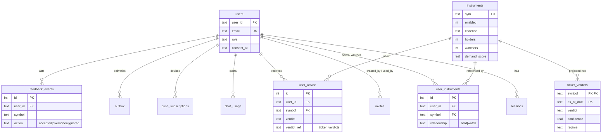
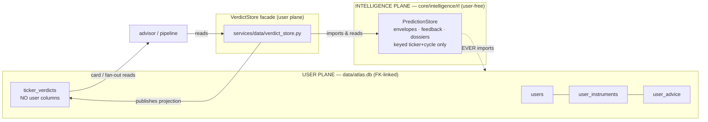

# Atlas M1 Data-Architecture — Design Spec (Task B2)

> **Role:** Designer pass of the Atlas Phase-B 3-agent loop (Researcher → **Designer** → Reviewer).
> **Date:** 2026-07-26 · **Branch:** `atlas-b` (docs only) · **Inputs:** the Researcher memo
> `docs/superpowers/research/2026-07-26-atlas-data-research.md`, `docs/SCALING_BLUEPRINTS.md`
> (BP1/2/4/5 + Learning Constitution R1–R4), `docs/LEGAL_AND_COMPLIANCE.md` §2/§5.
> **Status:** **APPROVED by the Reviewer** (Task B3 loop closed — findings R1–R6 from
> `docs/superpowers/research/2026-07-26-atlas-data-review.md` applied), pending the **B4
> user-ratification gate**. **Nothing here is implemented** — this spec drives Phase C.
>
> Every DDL statement below was instantiated in `sqlite3` with `PRAGMA foreign_keys=ON`; the
> DPDP cascade and the CHECK/FK constraints were exercised (a single `DELETE FROM users`
> cascades to the 7 PII-bearing user tables and `SET NULL`s the retained `invites` audit rows,
> while the user-free `instruments`/`ticker_verdicts` survive).
> Signatures were re-read from source, not memory (advisor `:100-187`, prediction_store
> `:129/:193/:266`, user_store `:36-67/:169`, channels `:35-88`, log_store `:54-77`,
> portfolio store `:400`, portfolio schema, `managed_tickers.json`, `settings/loader.py cfg()`).

---

## 0. Scope & the one-sentence shape

M1 introduces **one new relational SQLite database, `data/atlas.db`**, on the existing Railway
volume. It holds the user-plane relational core with **enforced foreign keys** — `users`,
`instruments`, the missing `user_instruments` join, the plane-boundary `ticker_verdicts`
projection, `user_advice`, and the greenfield `outbox`/`feedback_events` — folding in today's
`users.db`, the global `watchlist.json`, and `push_subscriptions.json`. `chat_sessions.db` and
`telemetry.db` stay as separate DB files (they have deliberate lifecycle reasons — below). The
advisor's direct reach into `core/intelligence/` (`advisor.py:21`) is replaced by a **read-only
`VerdictStore` facade** that lives in the user plane and duck-types the exact `PredictionStore`
read surface, so the intelligence plane never gains a user reference (Learning Constitution R1).

**Added cost at M1 scale (≤1k users): $0/mo** — no new Railway addon, no new service. (≤ $5/mo budget met with room to spare.)

---

## 1. Store engine decision (Question 1)

The app **already runs 4+ SQLite DBs on the volume** (`users.db`, `chat_sessions.db`,
`telemetry.db`, `scores.db`) with the WAL + process-wide-connection recipe, and the live
volume is tiny (Researcher: 0 registered users, 1 `primary` portfolio dir, 3 managed tickers,
1,931 `llm_calls` rows). The relational integrity we lack (real FKs, a reverse `user→instrument`
index, a single-transaction DPDP delete) is a **schema** problem, not an **engine** problem.

### Recommendation: **volume-SQLite with enforced FKs** (`data/atlas.db`), Postgres deferred.

Consolidate the FK-linked user-plane tables into one new DB file, `data/atlas.db`, opened with
`PRAGMA foreign_keys=ON` on **every** connection (per-connection pragma, not persisted — the
store module must issue it in `_get_conn()`, same place `users.db` sets `journal_mode=WAL`).
`user_store.py`'s own docstring already anticipates this: *"Portable SQL only (the M1 Postgres
move is a dump/load)."* We keep that portability and pay nothing now.

| | **A — volume-SQLite + enforced FKs (RECOMMEND)** | **B — Postgres (Railway addon)** |
|---|---|---|
| $/mo added | **$0** | ~+$5/mo (addon) + egress |
| Ops surface | none new — same volume, same backup email, same `sqlite3` recipe | `DATABASE_URL` secret, `psycopg`, a migration tool, connection pool, addon lifecycle |
| Concurrency | WAL: many readers, writes serialized by the write lock; `busy_timeout` absorbs contention across processes | true MVCC multi-writer |
| FK / CASCADE | full (proven above) | full |
| Single-txn DPDP delete | yes (one `DELETE FROM users` cascades) | yes |
| Migration cost later | dump → load (portable SQL kept deliberately) | n/a |
| Risk | `SQLITE_BUSY` if **concurrent write throughput** exceeds `busy_timeout` (measurable — see triggers) | new failure modes (pool exhaustion, addon outage) for zero M1 benefit |

> **Multi-writer reality (reviewer R1):** the app already runs `uvicorn --workers 2` (`Dockerfile:47`),
> so `atlas.db` will have **two API-writer processes from day one** (signup/session, plus the M1
> write-through paths: `add_holding`, `chat_usage`, `push_subscribe`, `feedback_events`), alongside
> the single scheduler-owner worker doing batch writes. This is **not** a future event — it is the
> starting condition, and it is fine: `users.db` and `chat_sessions.db` **already** run under
> `--workers 2` with this exact WAL + `busy_timeout` recipe and serialize writes cleanly at this
> scale. SQLite's write lock + `busy_timeout=5000` makes concurrent *processes* correct (one commits
> at a time); the only thing that breaks it is *sustained throughput* exceeding the timeout — a
> measurable quantity, not a process count.

**Migration-trigger criteria** — move `atlas.db` → Postgres when **any** fires (each is *measurable*,
not "a second process appeared" — that already happened):

1. **Write-contention pressure (primary):** `SQLITE_BUSY` errors on the `atlas.db` write path appear
   in telemetry at a non-trivial rate (target: ~0 today), **or** p99 write latency on the
   outbox/feedback path climbs under `busy_timeout` contention. This is the real signal that the
   two API workers + scheduler-owner + (M1) in-process outbox drainer are outgrowing the single
   write lock — and it maps to BP2's "first true service split."
2. **Write throughput:** sustained > ~50 writes/sec on `atlas.db`.
3. **Size:** any single hot table > ~5M rows, or `atlas.db` > ~2 GB (the volume backup email
   stops being practical well before the 4.9 GB volume fills).
4. **User count > ~1k** (the declared M1 ceiling) — re-evaluate regardless.

At today's scale every one of these is orders of magnitude away (0 `SQLITE_BUSY`, <<1 write/sec).
**Ratify SQLite for M1.**

### Why three DBs, not one

| DB file | Holds | Why separate | FK reality |
|---|---|---|---|
| **`data/atlas.db`** (NEW) | users, sessions, invites, chat_usage, instruments, user_instruments, ticker_verdicts, user_advice, push_subscriptions, outbox, feedback_events | the FK-linked PII core; DPDP delete = one cascade | **real FKs** |
| `data/chat_sessions.db` (exists, A2) | chat_turns | **deliberately excluded from the nightly backup email** (conversational content) — folding it into the backed-up `atlas.db` would leak chat into backups | `user_id` = app-enforced logical ref (SQLite FKs cannot cross DB files) |
| `data/telemetry.db` (exists) | llm_calls, app_logs, cost_by_user_day (NEW rollup) | high-volume append; BP4 says `user_id` is **nullable, NULL = "shared brain"** — a hard FK would be wrong by design | `user_id` = nullable logical ref |

Cross-DB references (`chat_turns.user_id`, `llm_calls.user_id`) are validated at write time and
cleaned on delete (§ Learning-Constitution / DPDP), not enforced by SQL — an accepted, documented
trade for keeping chat out of backups and telemetry's NULL-means-shared semantics intact.

---

## 2. Schema — runnable DDL (Question 2)

`PRAGMA foreign_keys=ON;` is issued per connection by the store module. Tables are created
owner-first so FK targets exist before dependents (also required for the cascade to be complete).
All `TEXT` timestamps are ISO-8601, matching the existing stores.

```sql
-- data/atlas.db  — Atlas M1 user-plane relational core.
-- The store opens every connection with: PRAGMA journal_mode=WAL; PRAGMA busy_timeout=5000;
-- PRAGMA foreign_keys=ON;   (foreign_keys is per-connection and NOT persisted.)

------------------------------------------------------------------- identity (from users.db)
CREATE TABLE IF NOT EXISTS users (
  user_id      TEXT PRIMARY KEY,
  email        TEXT NOT NULL UNIQUE,
  pw_hash      TEXT NOT NULL,
  display_name TEXT NOT NULL DEFAULT '',
  role         TEXT NOT NULL DEFAULT 'member',
  created_at   TEXT NOT NULL,
  consent_at   TEXT NOT NULL                       -- DPDP consent timestamp (kept from users.db)
);

CREATE TABLE IF NOT EXISTS sessions (
  token_hash TEXT PRIMARY KEY,                      -- SHA-256 of the raw token (unchanged)
  user_id    TEXT NOT NULL REFERENCES users(user_id) ON DELETE CASCADE,
  created_at REAL NOT NULL,
  expires_at REAL NOT NULL,
  last_seen  REAL NOT NULL
);
CREATE INDEX IF NOT EXISTS idx_sessions_user ON sessions(user_id);

CREATE TABLE IF NOT EXISTS invites (
  code       TEXT PRIMARY KEY,
  created_by TEXT REFERENCES users(user_id) ON DELETE SET NULL,   -- keep the invite-graph edge if the creator is erased (reviewer R6a)
  created_at TEXT NOT NULL,
  used_by    TEXT REFERENCES users(user_id) ON DELETE SET NULL,   -- keep the "used" audit if consumer is erased
  used_at    TEXT
);

CREATE TABLE IF NOT EXISTS chat_usage (
  user_id   TEXT NOT NULL REFERENCES users(user_id) ON DELETE CASCADE,
  day       TEXT NOT NULL,                          -- IST day, matches user_store._ist_today()
  llm_turns INTEGER NOT NULL DEFAULT 0,
  PRIMARY KEY (user_id, day)
);

------------------------------------------------------------------- universe (from managed_tickers.json)
CREATE TABLE IF NOT EXISTS instruments (
  sym           TEXT PRIMARY KEY,                   -- NSE symbol, upper-case
  name          TEXT NOT NULL DEFAULT '',
  sector        TEXT NOT NULL DEFAULT '',
  enabled       INTEGER NOT NULL DEFAULT 0,         -- analysis on/off (existing field)
  origin        TEXT NOT NULL DEFAULT 'seed',       -- seed|held|watched|discovery|on_demand (existing)
  cadence       TEXT NOT NULL DEFAULT 'on_demand',  -- daily|weekly|on_demand (existing + BP1 tiers)
  status        TEXT NOT NULL DEFAULT 'active',     -- active|archived (BP1 demote-not-delete)
  promoted_at   TEXT,                               -- existing field
  holders       INTEGER NOT NULL DEFAULT 0,         -- BP1 demand input (aggregate count, no identity)
  watchers      INTEGER NOT NULL DEFAULT 0,         -- BP1
  chat_hits_7d  INTEGER NOT NULL DEFAULT 0,         -- BP1
  demand_score  REAL NOT NULL DEFAULT 0,            -- 3*holders + 1*watchers + 0.5*chat_hits_7d (weights in cfg)
  last_analyzed TEXT,                               -- BP1 staleness-honesty
  created_at    TEXT NOT NULL DEFAULT '',
  updated_at    TEXT NOT NULL DEFAULT '',
  CHECK (cadence IN ('daily','weekly','on_demand')),
  CHECK (status  IN ('active','archived'))
);

------------------------------------------------------------------- the missing join
CREATE TABLE IF NOT EXISTS user_instruments (
  id           INTEGER PRIMARY KEY AUTOINCREMENT,
  user_id      TEXT NOT NULL REFERENCES users(user_id)     ON DELETE CASCADE,
  symbol       TEXT NOT NULL REFERENCES instruments(sym)   ON DELETE CASCADE,
  relationship TEXT NOT NULL,                       -- held|watch  (NO qty/price — see rationale)
  added_at     TEXT NOT NULL DEFAULT '',
  UNIQUE (user_id, symbol, relationship),
  CHECK (relationship IN ('held','watch'))
);
CREATE INDEX IF NOT EXISTS idx_user_instruments_symbol ON user_instruments(symbol, relationship);

------------------------------------------------------------------- PLANE BOUNDARY (user-free projection)
CREATE TABLE IF NOT EXISTS ticker_verdicts (
  symbol                TEXT NOT NULL REFERENCES instruments(sym) ON DELETE CASCADE,
  as_of_date            TEXT NOT NULL,              -- trading/review date
  verdict               TEXT NOT NULL DEFAULT 'HOLD',       -- shared RESEARCH verdict for the card (RA-safe)
  confidence            REAL NOT NULL DEFAULT 0.5,          -- mean remaining envelope confidence
  regime                TEXT NOT NULL DEFAULT 'NORMAL',
  triggers              TEXT NOT NULL DEFAULT '[]',         -- JSON array of rule codes
  envelope_direction    TEXT NOT NULL DEFAULT 'FLAT',       -- UP|DOWN|FLAT
  predicted_close       REAL,                               -- last remaining daily forecast close
  confidence_trend      REAL NOT NULL DEFAULT 0,            -- last-remaining conf − first-remaining conf
  reversion_prior       REAL NOT NULL DEFAULT 0,
  reforecast_reason     TEXT NOT NULL DEFAULT '',
  direction_accuracy_7d REAL,
  thesis_intact         INTEGER,                            -- 0|1|NULL
  cycle_id              TEXT NOT NULL DEFAULT '',           -- provenance "{TICKER}_{YYYY-MM}"
  source                TEXT NOT NULL DEFAULT 'projection', -- projection|on_demand
  created_at            TEXT NOT NULL DEFAULT '',
  PRIMARY KEY (symbol, as_of_date)                          -- NO user columns (R1)
);
CREATE INDEX IF NOT EXISTS idx_ticker_verdicts_date ON ticker_verdicts(as_of_date);

------------------------------------------------------------------- per-user application (from advice_ledger.jsonl)
CREATE TABLE IF NOT EXISTS user_advice (
  id                 INTEGER PRIMARY KEY AUTOINCREMENT,
  user_id            TEXT NOT NULL REFERENCES users(user_id)   ON DELETE CASCADE,
  symbol             TEXT NOT NULL REFERENCES instruments(sym) ON DELETE CASCADE,
  as_of_date         TEXT NOT NULL,
  verdict            TEXT NOT NULL,                 -- HOLD|ADD|TRIM|EXIT|SWITCH (personal, position-sized)
  verdict_ref        TEXT NOT NULL DEFAULT '',      -- "symbol|as_of_date" → ticker_verdicts provenance
  close              REAL NOT NULL DEFAULT 0,       -- price at decision
  unrealised_pnl_pct REAL NOT NULL DEFAULT 0,       -- P&L at decision
  stop_pct           REAL NOT NULL DEFAULT 0,       -- stop at decision
  confidence         REAL NOT NULL DEFAULT 0.5,
  triggers           TEXT NOT NULL DEFAULT '[]',
  rationale_hash     TEXT NOT NULL DEFAULT '',
  outcome_10td       REAL,                          -- filled later by review machinery
  outcome_30td       REAL,
  outcome_60td       REAL,
  created_at         TEXT NOT NULL DEFAULT '',
  UNIQUE (user_id, symbol, as_of_date)
);
CREATE INDEX IF NOT EXISTS idx_user_advice_user_date ON user_advice(user_id, as_of_date);

------------------------------------------------------------------- PII channels (from push_subscriptions.json, A1)
CREATE TABLE IF NOT EXISTS push_subscriptions (
  id         INTEGER PRIMARY KEY AUTOINCREMENT,
  user_id    TEXT NOT NULL REFERENCES users(user_id) ON DELETE CASCADE,
  endpoint   TEXT NOT NULL,
  p256dh     TEXT NOT NULL DEFAULT '',
  auth       TEXT NOT NULL DEFAULT '',
  created_at TEXT NOT NULL DEFAULT '',
  UNIQUE (user_id, endpoint)
);

------------------------------------------------------------------- BP2 outbox (greenfield)
CREATE TABLE IF NOT EXISTS outbox (
  id              INTEGER PRIMARY KEY AUTOINCREMENT,
  user_id         TEXT NOT NULL REFERENCES users(user_id) ON DELETE CASCADE,
  channel         TEXT NOT NULL,                    -- push|email
  kind            TEXT NOT NULL,                    -- brief|digest|weekly|alert
  payload_ref     TEXT NOT NULL,                    -- REFERENCE not blob (BP2)
  dedupe_key      TEXT NOT NULL UNIQUE,             -- user_id + kind + date (idempotency, BP2)
  status          TEXT NOT NULL DEFAULT 'queued',   -- queued|delivered|failed|dead
  attempts        INTEGER NOT NULL DEFAULT 0,
  created_at      TEXT NOT NULL,
  next_attempt_at TEXT,                             -- backoff schedule (1m/5m/30m)
  delivered_at    TEXT,
  CHECK (channel IN ('push','email')),
  CHECK (kind    IN ('brief','digest','weekly','alert')),
  CHECK (status  IN ('queued','delivered','failed','dead'))
);
CREATE INDEX IF NOT EXISTS idx_outbox_ready ON outbox(status, next_attempt_at);

------------------------------------------------------------------- BP5 feedback (greenfield, user plane, OUTSIDE intelligence)
CREATE TABLE IF NOT EXISTS feedback_events (
  id                 INTEGER PRIMARY KEY AUTOINCREMENT,
  ts                 TEXT NOT NULL,
  user_id            TEXT NOT NULL REFERENCES users(user_id) ON DELETE CASCADE,
  symbol             TEXT NOT NULL,
  advice_ref         TEXT NOT NULL DEFAULT '',      -- → user_advice
  verdict_shown      TEXT NOT NULL DEFAULT '',
  action             TEXT NOT NULL,                 -- accepted|overridden|ignored
  override_direction TEXT NOT NULL DEFAULT '',
  position_state     TEXT NOT NULL DEFAULT '',      -- winning|losing|'' (for R4 bias audit)
  CHECK (action IN ('accepted','overridden','ignored')),
  CHECK (position_state IN ('winning','losing',''))
);
CREATE INDEX IF NOT EXISTS idx_feedback_events_symbol ON feedback_events(symbol);
```

### chat_turns — target shape (unchanged from A2, stays in `chat_sessions.db`)

```sql
-- data/chat_sessions.db  (separate DB; user_id is an app-enforced logical reference)
CREATE TABLE IF NOT EXISTS chat_turns (
    id         INTEGER PRIMARY KEY AUTOINCREMENT,
    session_id TEXT NOT NULL,
    user_id    TEXT NOT NULL DEFAULT 'primary',     -- shipped in A2; logical ref to atlas.db users
    ts         TEXT NOT NULL,
    role       TEXT NOT NULL,
    content    TEXT NOT NULL
);
CREATE INDEX IF NOT EXISTS idx_chat_turns_session ON chat_turns(user_id, session_id, id);
CREATE INDEX IF NOT EXISTS idx_chat_turns_ts ON chat_turns(ts);
```

### telemetry — additive BP4 migration (stays in `telemetry.db`)

```sql
-- data/telemetry.db  (additive, nullable — all existing rows/writers keep working)
ALTER TABLE llm_calls ADD COLUMN user_id TEXT;      -- NULL = "shared brain" (BP4 rule)
-- nightly roll-up:
CREATE TABLE IF NOT EXISTS cost_by_user_day (
  day     TEXT NOT NULL,
  user_id TEXT,                                     -- NULL bucket = shared brain
  calls   INTEGER NOT NULL DEFAULT 0,
  tokens  INTEGER NOT NULL DEFAULT 0,
  cost_usd REAL NOT NULL DEFAULT 0,
  PRIMARY KEY (day, user_id)
);
```

### Which existing store each table subsumes / migrates from

| New table (`atlas.db`) | Subsumes / migrates from | Notes |
|---|---|---|
| `users`, `sessions`, `invites`, `chat_usage` | **`data/users.db`** (whole file) | `users.db` retired after cutover; FKs now enforced |
| `instruments` | **`data/managed_tickers.json`** | JSON kept as read-through export until decommission; BP1 demand fields added |
| `user_instruments` | **greenfield** — derived from `portfolio.json` holdings + `Portfolio.watchlist` | the reverse index/refcount that finding #3 lacked |
| `ticker_verdicts` | **greenfield projection** of RL envelopes/feedback (read-only view of `PredictionStore` output) | the plane boundary (finding #4) |
| `user_advice` | **`data/portfolio/<uid>/advice_ledger.jsonl`** (`AdviceRecord`) | JSONL stays append-only as the raw audit; table is the queryable index |
| `push_subscriptions` | **`data/delivery/push_subscriptions.json`** (A1 shape `{uid:[sub]}`) | FK + `ON DELETE CASCADE` for DPDP |
| `outbox` | **greenfield** (BP2) | replaces inline fan-out |
| `feedback_events` | **greenfield** (BP5) | ships with accept/override advice-card UI |
| `chat_turns` | **`data/chat_sessions.db`** (A2, in place) | not moved — backup-exclusion |
| `llm_calls.user_id`, `cost_by_user_day` | **`data/telemetry.db`** (in place, BP4) | additive; NULL = shared brain |

**Kept as the source of truth (NOT migrated into `atlas.db`):** `portfolio.json` (holdings +
position economics + cash/capital/autopilot flags), `advice_ledger.jsonl`,
`transactions.jsonl`, `value_history.jsonl`, digests/briefs/weekly JSON, and everything under
`core/intelligence/rl/` (envelopes, feedback logs, ledgers, dossiers, scorecards). Rationale in §3
and the `user_instruments` decision below.

---

## 3. Plane boundary — the `VerdictStore` read facade (Question 3)

**Problem restated:** `core/portfolio/advisor.py:21` and `core/portfolio/pipeline.py:15-17`
import `PredictionStore` straight out of `core.intelligence.rl.stores` — the user plane reaching
into the intelligence plane. R1 holds on the intelligence *side* (it never imports user code),
but the coupling is a latent breach.

### Design: a user-plane facade that duck-types the exact `PredictionStore` read surface

The advisor makes exactly three calls (verified `advisor.py:136,157` against
`prediction_store.py:129,193,266`):

| Advisor call | `PredictionStore` signature | Attributes advisor reads |
|---|---|---|
| `store.cycle_id_for(review_date)` | `cycle_id_for(target: date) -> str` (`:129`) | `"{TICKER}_{YYYY-MM}"` |
| `store.load_envelope(cid)` | `load_envelope(cycle_id=None) -> PredictionEnvelope\|None` (`:193`) | `daily_forecasts[].date/.predicted_close/.confidence`, `conviction_streak.reversion_prior`, `reforecast_history[-1].reason` |
| `store.load_feedback_log(cid)` | `load_feedback_log(cycle_id=None) -> DailyFeedbackLog` (`:266`) | `entries[].regime_label/.direction_correct/.thesis_review.thesis_intact` |

The facade reproduces this surface **byte-for-byte at the call site**, so Phase C's advisor change
is a one-line import + type-hint swap with **zero change to `build_signals`/`decide` logic**:

```python
# services/data/verdict_store.py   (NEW — user/data plane)
from __future__ import annotations
from datetime import date

class EnvelopeView:                 # read-only; exposes ONLY what build_signals reads
    daily_forecasts: list          # each: .date (str) .predicted_close (float) .confidence (float)
    conviction_streak: object      # .reversion_prior (float)
    reforecast_history: list       # each: .reason (str)

class FeedbackView:                 # read-only
    entries: list                  # each: .regime_label (str) .direction_correct (bool)
                                   #       .thesis_review (obj|None → .thesis_intact bool)

class VerdictStore:
    """User-plane read seam over ticker-keyed intelligence output. Imports the
    intelligence plane; the intelligence plane NEVER imports this. Hot-path safe:
    every read degrades to None/empty on failure (advisor already treats missing
    artifacts as conservative defaults, advisor.py:152-171)."""
    def __init__(self, ticker: str, sector: str | None = None) -> None: ...
    def cycle_id_for(self, target: date) -> str: ...               # delegates to PredictionStore
    def load_envelope(self, cycle_id: str | None = None) -> EnvelopeView | None: ...
    def load_feedback_log(self, cycle_id: str | None = None) -> FeedbackView: ...

    # higher-level card/fan-out read (served from the ticker_verdicts projection):
    def get_verdict_card(self, symbol: str, as_of: date) -> dict | None: ...
```

`build_signals(..., store: VerdictStore, ...)` — the parameter name/type change and the import
line at `advisor.py:21`/`pipeline.py:17` are the **entire** advisor diff. Its call sites
(`store.cycle_id_for`, `store.load_envelope`, `store.load_feedback_log`) are untouched.

### Who populates `ticker_verdicts` — decision: **user-plane projection, NOT the intelligence plane**

The task offered two options; the choice matters for R1.

- **Chosen:** `ticker_verdicts` is written by a **user-plane projection step** in the existing
  post-review pipeline (`core/portfolio/pipeline.py`, which already runs after the daily reviews).
  After analysis, the pipeline calls `VerdictStore.publish_projection(symbol, as_of, ...)` which
  reads the freshly-written **ticker-keyed** envelope/feedback (no user refs) and denormalizes the
  advisor/card fields into one `ticker_verdicts` row. The facade's per-advisor reads
  (`load_envelope`/`load_feedback_log`) still delegate to `PredictionStore` for the live drift
  math; the **table** is the fast multi-user read model for briefs/chat L0-cards/refcount surfaces
  (serve 1k users without re-reading envelope files per user), with an on-demand envelope-read
  fallback on cache miss.
- **Rejected:** the intelligence plane writing `ticker_verdicts` directly. That would give
  `core/intelligence/` a dependency on `atlas.db` — a database that also holds `users`,
  `user_advice`, `feedback_events`. Even with no user *column* on that one table, the *direction*
  of the dependency (intelligence → user-plane DB) is exactly what erodes R1 over time. **The
  dependency must point user→intelligence only.** Projection reads flow that way; the intelligence
  plane stays import-clean.

**This is a refinement of BP1/Task wording** ("written by the intelligence plane") to
"written by a user-plane projection that *reads* ticker-keyed intelligence output" — flagged for
the B4 gate as the one deliberate deviation (§ open questions).

### What stays a direct intelligence-internal call (does NOT route through the facade)

- **All callers inside `core/intelligence/rl/`** — the RL engine reads/writes its own
  `PredictionStore` directly. The facade is *only* for user-plane callers (advisor, pipeline).
- **`is_trading_day`** (`advisor.py:176`, `pipeline.py:16`, `brief.py`, `index_watch.py` via
  `core.intelligence.rl.nse_calendar`) — a **stateless market-calendar utility**, no learning
  state, no user refs, R1-irrelevant. Leave as a direct import in M1; a later relocation to a
  neutral `core/market/` home is cosmetic (noted, not scheduled).
- **`get_price_history`** (`pipeline.py:15`, `core.intelligence.algorithms...fetcher`) — data
  plane, not a learning store. Direct import stays.
- **`next_results_event`** (`advisor.py:22`, `services.data.fetchers`) — already data plane.

---

## 4. Universe refcounting (Question 4)

`user_instruments` is the reverse index BP1 needs. It is maintained **transactionally on the
portfolio write path** and **rebuilt nightly** as a backstop (both cheap at ≤1k users):

- `PortfolioStore.add_holding` → upsert `user_instruments(user, sym, 'held')`; ensure an
  `instruments` row exists (create `origin='held', cadence='daily'` — held is always daily, BP1).
- `remove_holding` → delete the `held` row.
- `add_watchlist` → upsert `(user, sym, 'watch')`; ensure `instruments` row
  (`origin='watched', cadence='weekly'` if new).
- `remove_watchlist` → delete the `watch` row.

**Nightly Universe recompute — runs in the USER/DATA plane** (it reads `user_instruments`, which
carries `user_id`), writing only **aggregate counts + cadence** into `instruments`:

1. `holders = COUNT(DISTINCT user_id WHERE relationship='held')`,
   `watchers = COUNT(DISTINCT ... 'watch')`. **`chat_hits_7d = 0` at M1 (reviewer R4):** no store
   today carries per-symbol chat mentions — `llm_calls` has no `symbol` column (Researcher #7) and
   `chat_turns` is free-text only, so the term is *unimplementable* against the current schema.
   Defer the source to a named M1.x follow-up: a tiny `symbol_mentions(symbol, user_id, ts)` tap
   written when the chat symbol-resolver (NSE-first) identifies a ticker, aggregated over 7 days.
   Until that ships, `w_c·chat_hits_7d = 0` and holders/watchers alone drive cadence (adequate at
   ≤1k users). The column and weight stay in the schema/`cfg` so enabling the tap is additive.
2. `demand_score = w_h·holders + w_w·watchers + w_c·chat_hits_7d` — weights in
   `cfg("universe.demand_weights", …)` (BP1: 3 / 1 / 0.5); `chat_hits_7d` is 0 until the M1.x tap.
3. Cadence tiers: every **held** ticker → `daily`; top-N by demand → `daily`
   (N = `cfg("universe.max_daily_analyses", …)`); watched long tail → `weekly`; rest → `on_demand`.
   Budget governor fires an ops alert at `cfg("universe.budget_alert_pct", fallback=0.8)`.

> **R1 correction to BP1:** BP1 says this job "runs in the intelligence plane." Because it must
> read `user_instruments` (user identity), it runs **user-plane**; only its *aggregate output*
> (counts, cadence, `enabled`) is written to `instruments`, which the scheduler/intelligence plane
> then reads. The intelligence plane sees counts, never a `user_id`. (Flagged at B4.)
>
> **Why this is not an R1 leak (reviewer R6b):** `instruments` now carries user-derived aggregates
> (`holders`, `watchers`, `demand_score`) read by the scheduler to pick cadence — the design's
> closest approach to the R1 line. This is **explicitly permitted by R2** (`SCALING_BLUEPRINTS.md:232`:
> *"aggregates … may rank the universe (Blueprint 1's demand score)"*). The demand→cadence path is
> **universe ranking (which tickers get analyzed, how often)** — it never enters reward, scorecard,
> duel, envelope, or regime-multiplier math (R1). The counts are a *feature for universe membership*,
> not a reward signal; the ≥20-user R3 floor does not gate them (they are membership counts, not
> feedback aggregates).

**Demote policy when holder+watcher refcount hits 0** — *never hard-delete an instrument the
intelligence plane has history for:*

- refcount → 0: set `cadence='on_demand'`, `enabled=0`. Analysis stops; the row and all
  `core/intelligence/rl/` history (envelopes, dossier, ledgers) are **preserved** untouched.
- Archive (`status='archived'`) **only if** the instrument has **no** intelligence history
  (no `data/predictions/**/<TICKER>/` dir) **and** `origin IN ('watched','on_demand','discovery')`
  **and** it has been refcount-0 for `cfg("universe.archive_grace_days", fallback=30)`.
- `origin='seed'`/`'held'`-derived instruments with history are never archived — only demoted.

The scheduler keeps reading one table (`instruments WHERE enabled=1`) exactly as it reads the JSON
file today; nothing in the intelligence plane changes.

---

## 5. Global-singleton resolution (Question 5)

| Singleton (today) | Decision | Where it lives at M1 |
|---|---|---|
| **`data/watchlist.json`** (global `list[str]`) | **KILL — merge into per-user** | single source of truth = per-user `Portfolio.watchlist` (`list[WatchlistItem]`), projected into `user_instruments(relationship='watch')`. The global file's UI endpoints (`ui_data.py` PUT `:1048`) become per-user. |
| **`Portfolio.watchlist`** (`list[WatchlistItem]`) | **KEEP as the one watchlist** | `portfolio.json` (SoT) + `user_instruments` index. |
| `data/agent_weights.json` | **Owner/global config, NOT per-user** | shared-brain tuning knob; stays a `data/` config file, `require_owner` to write. |
| `data/agent_tasks.json` | **Owner/global config** | same — task toggles tune the shared pipeline. |
| `data/category_tickers.json` | **Owner/global config** | category→ticker overrides tune shared discovery. |

**Why the three agent/task/category files are owner-config, not per-user:** they tune the **one
shared brain** — the ensemble weights, agent task flags, and category mappings that produce the
verdicts *all* users read. Per-user copies would fork the analysis pipeline per tenant, multiply
LLM cost by the user count, and destroy the shared-brain economic model and the learning coherence
R1–R4 depend on. The legitimate per-user tuning knob already exists and is already in the right
place: **`Portfolio.risk_profile`** (`conservative|balanced|aggressive`,
`schemas/portfolio.py:92`), which the advisor already honors (`advisor.py:89`). No schema change
for the three config files; they remain global, owner-gated.

**Duplicate-watchlist kill sequence** (Phase C): at cutover, merge `watchlist.json` entries into
the **owner's** `Portfolio.watchlist` (dedupe by symbol), project all watch rows into
`user_instruments`, repoint the UI read/write endpoints to the per-user store, then decommission
`watchlist.json` after the retention window.

---

## 6. Migration plan (Question 6)

### Pick: **freeze-cutover on a weekend window**, additive, feature-flagged, NOT dual-write

**Why not dual-write:** dual-write earns its complexity only when you cannot stop writes. Here the
live dataset is *trivially small* (0 registered users, 1 `primary` dir, 3 tickers) and there is
exactly **one** active writer (the owner). The consistency machinery of a dual-write window would
be pure overhead. Crucially, **`portfolio.json` remains the economics source of truth** post-M1 —
`user_instruments`/`user_advice` are *derived indexes*, so there is no money-state dual-write to
reconcile at all; only the index needs a transactional update on the hot path plus the nightly
rebuild.

**Why weekend:** Global Constraints forbid main pushes 16:25–17:15 IST on trading days and mark
weekends deploy-safe. On a weekend the autopilot fan-out (weekdays 16:30 IST) and morning brief
(08:50 IST) do not run — a natural freeze with no scheduler contention.

**Feature flag:** `cfg("atlas.enabled", env="ATLAS_ENABLED", fallback=false)`. Fan-out and stores
read `atlas.db` only when true; false = today's JSON/`users.db`/dir-scan path unchanged. This is
the escape hatch and the rollback lever.

### Cutover sequence (Phase C, run once on a weekend)

1. **Deploy dormant** (`ATLAS_ENABLED=false`): ship `atlas.db` schema + `VerdictStore` +
   `user_instruments` write-through, all behind the flag. Behavioral no-op. Verify green.
2. **Freeze:** confirm no scheduled job is mid-run (weekend; `/scheduler/status` idle).
3. **Run the ETL script** (idempotent, additive — reads sources, writes `atlas.db`, deletes
   nothing):
   - `users.db` → `users/sessions/invites/chat_usage` (ATTACH + `INSERT … SELECT`; 0 rows today
     but correct for the general case).
   - `push_subscriptions.json` (`{uid:[sub]}`) → `push_subscriptions` rows.
   - `managed_tickers.json` → `instruments` (3 rows; demand fields default 0; keep
     `origin/cadence/enabled/promoted_at`).
   - each `data/portfolio/<uid>/portfolio.json`: `holdings[]` → `user_instruments(held)`,
     `watchlist[]` → `user_instruments(watch)`; ensure `instruments` rows exist.
   - each `advice_ledger.jsonl` → `user_advice`.
   - `watchlist.json` → merge into owner's `Portfolio.watchlist`, then `user_instruments(watch)`.
   - `telemetry.db`: `ALTER TABLE llm_calls ADD COLUMN user_id` (in place).
   - `chat_sessions.db`: already A2-migrated; no move.
4. **Ghost-dir reconciliation** (finding #6): for every `data/portfolio/<uid>/` dir:
   - `uid == PORTFOLIO_DEFAULT_USER_ID` (`primary`) → **adopt to owner** (the owner's `user_id`
     *is* `primary`, per the Phase-A memory; a `users` row already exists for them).
   - `uid` has a matching `users` row → keep.
   - `uid` with **no** `users` row → **quarantine**: move to `data/portfolio/_quarantine/<uid>/`,
     do **not** trade it, emit one ops alert for human review. (No silent adoption of strangers.)
5. **Validate:** row-count assertions (users, instruments, user_instruments,
   holders/watchers recompute), a dry-run `active_user_ids()` equals the intended set, DDL
   integrity check.
6. **Flip `ATLAS_ENABLED=true`** and deploy. Fan-out switches from `list_user_ids()` (dir scan) to
   `active_user_ids()` (users-table query).
7. **First-run watch:** next trading day verify 16:30 autopilot + 08:50 brief fan out to exactly
   the owner (and any real users), no ghost dirs.
8. **Decommission** `users.db` / `watchlist.json` / `push_subscriptions.json` /
   `managed_tickers.json` only after `cfg("atlas.retention.source_decommission_days", fallback=14)`
   of green operation. Keep them read-only until then.

### The `list_user_ids()` → `active_user_ids()` switch (keeps the owner, drops ghosts)

Today four fan-out sites scan directories with **inconsistent** owner fallback (Researcher):
`pipeline.py:39` (**no** fallback), `brief.py:270`, `weekly.py:240`, `index_watch.py:35`
(each `list_user_ids() or [PORTFOLIO_DEFAULT_USER_ID]`). Phase C introduces **one** helper and
points all four at it:

```python
def active_user_ids() -> list[str]:
    """Users the scheduler should fan out to. atlas.db is authoritative; the
    AUTH_REQUIRED=false single-user path is preserved."""
    if not cfg("atlas.enabled", env="ATLAS_ENABLED", fallback=False):
        return list_user_ids()                     # legacy dir scan (rollback path)
    ids = _atlas_user_ids()                         # SELECT user_id FROM users
    if not ids and not settings.AUTH_REQUIRED:      # anonymous ⇒ owner (local/single-user)
        return [settings.PORTFOLIO_DEFAULT_USER_ID]
    return ids
```

This **fixes finding #6** (ghost dirs no longer trade — they lack a `users` row), unifies the
inconsistent fallback, and preserves the `AUTH_REQUIRED=false ⇒ anonymous=owner` flow: with 0
users and auth off, it still yields `[primary]`, so owner autopilot/briefs never drop.

### Rollback

The ETL deletes nothing; every source file survives untouched behind the flag. **Rollback = set
`ATLAS_ENABLED=false` and redeploy** → instant revert to the dir-scan/JSON path. `atlas.db` can be
deleted and rebuilt from the still-present sources. Data loss is structurally impossible during the
retention window. (Mirrors the M0 escape hatch: `AUTH_REQUIRED=false` reverts auth.)

---

## 7. Lifecycle / retention (Question 7) — all caps via `cfg()`

| Store | Policy | Config key (fallback) |
|---|---|---|
| `chat_turns` | TTL sweep (existing `sweep_expired`) | `chat.session_ttl_days` (7) |
| `ticker_verdicts` | prune daily rows older than N (rebuildable from envelopes) | `atlas.retention.ticker_verdicts_days` (400) |
| `user_advice` | keep (audit); optional prune | `atlas.retention.user_advice_days` (None = keep) |
| `value_history` (JSONL) | cap points (read already caps at 400) | `atlas.retention.value_history_points` (400) |
| `feedback_events` | keep (learning input); DPDP-cascade per user regardless | `atlas.retention.feedback_events_days` (None = keep) |
| `outbox` | prune `delivered`/`dead` rows older than N | `delivery.outbox_retention_days` (30) |
| `sessions` | swept on expiry (existing `sweep_expired_sessions`) | — |
| `llm_calls` / `app_logs` | optional purge (today uncapped); `cost_by_user_day` retains the aggregate | `logging.telemetry_retention_days` (None) |

Delivery/outbox tunables also via `cfg()`: `delivery.outbox_max_attempts` (3),
`delivery.outbox_backoff_minutes` ([1,5,30]) — BP2. Retention jobs run in the existing nightly
lane (same place as the backup job), hot-path-safe (log + continue).

---

## 8. What M2 explicitly defers (Question 8)

Bounded scope — **not built at ≤1k users**, flagged for later:

- **Postgres / migrations tooling** — until a §1 trigger fires.
- **Outbox as a separate Railway service** — M1 runs the worker **in-process**; the second-service
  split is BP2's M2 step, gated on fan-out latency (~100+ users) and the concurrent-writer trigger.
  **Two-worker safety (reviewer R3):** the FastAPI lifespan runs in *every* uvicorn worker
  (`--workers 2`), and this app has already been bitten by "every cron job fired twice," which is
  why `server.py:306-388` binds a localhost socket so only **one** worker runs the scheduler/
  self-heal. The outbox drainer **runs only inside that same singleton-lock owner** (reuse the
  existing guard — no new lock), *and* claims each row atomically before sending:
  `UPDATE outbox SET status='sending', attempts=attempts+1 WHERE id=? AND status='queued'` — act
  only if `rowcount==1`. The `dedupe_key` UNIQUE prevents duplicate *rows*; the CAS prevents a
  duplicate *send* (belt-and-braces even if a second drainer ever exists). This is a Phase-C
  requirement, not an optional detail.
- **Sharding, read replicas, per-tenant encryption at rest, an event bus/message queue** — none
  earn their complexity at this scale.
- **Semantic chat cache embedding store (BP3)** — separate program; no table here.
- **`cost_by_user_day` as a separate analytics DB** — M1 keeps it a rollup table in `telemetry.db`.
- **Dossier compaction / episodic retrieval (BP6)** — intelligence-plane concerns, not M1 data
  architecture.
- **qty/avg_price duplicated into `user_instruments`** — deliberately *not* built (see decision).

---

## ERD



**The plane boundary** (why there is no FK from intelligence to users):



The only arrow into the intelligence plane is `VerdictStore → PredictionStore` (user→intelligence).
Nothing in `core/intelligence/` imports `atlas.db`, the facade, or `feedback_events`. R1 by
construction.

---

## Decisions table (the B4 ratification surface)

| # | Decision | Options | **Recommendation** | Why | Cost / risk |
|---|---|---|---|---|---|
| D1 | Store engine | Postgres addon vs volume-SQLite+FKs | **Volume-SQLite `atlas.db`, FKs on** | app already runs SQLite on the volume; integrity is a schema gap, not an engine gap; portable SQL keeps the Postgres door open | **$0/mo**; risk = single-writer ceiling, tracked by explicit §1 triggers |
| D2 | Verdict Store writer | intelligence writes `ticker_verdicts` vs user-plane projection | **User-plane projection; facade reads envelopes on demand** | dependency must point user→intelligence to hold R1; intelligence must not depend on a DB holding user tables | risk = projection staleness (mitigated: on-demand envelope fallback + daily rebuild) |
| D3 | `user_instruments` columns | store qty/avg vs membership-only index | **Membership-only (no economics)** | `portfolio.json` (atomic, FileLock, corp-action math) stays the one money SoT; avoids dual-write drift | risk = index/file drift (mitigated: hot-path upsert + nightly rebuild) |
| D4 | Migration style | dual-write vs freeze-cutover | **Freeze-cutover, weekend, feature-flagged** | dataset is tiny + one active writer; portfolio money-state isn't dual-written at all | risk = cutover bug (mitigated: `ATLAS_ENABLED=false` instant rollback, sources untouched) |
| D5 | Ghost dirs | adopt-all vs require users-row | **`primary`→owner; others→quarantine** | never silently trade a stranger's dir; fixes finding #6 | risk = a real dir mis-quarantined (mitigated: ops alert + human review, reversible) |
| D6 | Global singletons | per-user vs owner-config | **watchlist→per-user; agent_weights/tasks/category→owner-config** | one shared brain; per-user tuning already lives in `Portfolio.risk_profile` | low; kills the duplicate-watchlist bug (finding #5) |
| D7 | Outbox deployment | separate service vs in-process | **In-process worker at M1** | separate service is the concurrent-writer Postgres trigger; premature at ≤1k | defers BP2 service split to M2 |

---

## Learning-Constitution & DPDP compliance

**R1 — Reward isolation / intelligence stays user-free.** No table read by `core/intelligence/rl/`
carries a `user_id`. The one boundary table, `ticker_verdicts`, has **no user columns** (proven:
it survives the DPDP cascade). The dependency direction is strictly user→intelligence: the
`VerdictStore` facade imports `PredictionStore`; the intelligence plane imports neither the facade
nor `feedback_events` nor `atlas.db`. **Today R1 holds *by construction*, not by an automated
guard** (Researcher grep: zero tenant-identity references anywhere in `core/intelligence/`) — the
import-boundary check named in `SCALING_BLUEPRINTS.md:231` ("Enforced how") is a **prescription that
has never been implemented** (reviewer R2). **Phase C therefore CREATES it** (it is a required Phase-C
task, shipped *with* `verdict_store.py`): an AST/import walk asserting that `core/intelligence/**`
imports **none** of {`services/data/verdict_store.py`, the feedback store, `feedback_events`,
`atlas.db`/the user stores}. That test turns R1 from a convention into a build-time invariant the
moment the facade lands. The Universe recompute reads `user_instruments` but runs **user-plane** and
emits only aggregate counts to `instruments` (§4).

**R3 — Aggregation floor (≥20 users).** `feedback_events` is stored append-only and tenant-scoped;
**no feedback aggregate is consumed below `cfg("atlas.feedback.aggregation_floor_users",
fallback=20)`** — the aggregator refuses below the floor (privacy: no aggregate traceable to an
individual). The schema stores raw events; the *floor* is enforced at read/aggregate time, never in
config output (R2). BP1 `demand_score` uses `holders/watchers` **counts** (not feedback aggregates),
so it is unaffected by the floor.

**DPDP §2 — delete on request, single transaction.** One entry point,
`delete_user_completely(user_id)`:

1. **Atomic core (one SQL transaction on `atlas.db`):** `DELETE FROM users WHERE user_id=?` →
   `ON DELETE CASCADE` removes `sessions`, `chat_usage`, `user_instruments`, `user_advice`,
   `push_subscriptions`, `outbox`, `feedback_events` in a single commit (verified in the DDL check —
   all 7 drop to 0; `instruments`/`ticker_verdicts` survive). **`invites` rows are retained** with
   `created_by`/`used_by` → `SET NULL` (reviewer R6a): the invite-graph edge (who-invited-whom
   audit) outlives the erased identity, and no PII remains on the row (a `code` is not personal data).
   No feedback aggregate is affected because `feedback_events` is consumed only above the R3
   ≥20-user floor.
2. **Non-DB artifacts, same function, deterministic + idempotent** (SQLite FKs can't reach other
   files): `shutil.rmtree(data/portfolio/<uid>/)` (holdings, ledgers, digests — the PII-heavy dir);
   `chat_sessions.db`: `DELETE FROM chat_turns WHERE user_id=?`; `telemetry.db`: **anonymize**
   `UPDATE llm_calls SET user_id=NULL WHERE user_id=?` (keeps aggregate cost integrity, drops the
   identity — BP4's NULL bucket already means "unattributed").

Honest scoping: "single transaction" is a single atomic **cascade** for the relational PII core in
`atlas.db`; the three non-`atlas` artifacts are cleaned in the same **function** as idempotent,
retry-safe follow-ups (order: DB commit first, then filesystem). This satisfies DPDP's "one user_id
scope to erase" and closes the `delete_user:169-175` gap (which today clears only
sessions/chat_usage/users). It also fixes finding #6's PII half: push endpoints + email are pruned
on delete (LEGAL_AND_COMPLIANCE §2 bullet 4).

**Asymmetry, made deliberate (reviewer R5):** telemetry (`llm_calls`) is **anonymized**
(`user_id→NULL`) but `feedback_events` is **hard-deleted** (FK cascade) — opposite treatments for two
stores that both retain aggregate value after the user leaves (feedback feeds the R4 bias audit and,
eventually, R2 ranking). The chosen default is deliberate: a `feedback_event` is **behavioral PII**
(a named person's accept/override psychology on a specific verdict) — more sensitive than an
unattributed token count, and DPDP "delete on request" most cleanly means *remove it*. Losing it costs
little, because the R3 ≥20-user floor means no individual's feedback is ever consumed on its own
anyway. Telemetry is anonymized rather than deleted only to keep the **aggregate cost ledger**
whole (BP4's NULL bucket already means "unattributed"). This is a genuine privacy-vs-learning-value
judgment, not an implementation detail — **routed to the B4 gate as Q5** for ratification.

---

## Cost line

**Added infrastructure cost at M1 scale (≤1k users): $0/mo.** No Railway addon (SQLite on the
existing volume), no second service (outbox worker in-process). The only cost that scales is LLM
usage, which is *governed down* by this design (BP1 cadence budget + BP4 per-user tripwire), not up.
**≤ $5/mo budget met** (spend on the new data layer is $0).

---

## YAGNI — cut now, flagged M2

Postgres, separate outbox service, sharding, replicas, per-tenant encryption, event bus, BP3
embedding store, separate analytics DB, dossier compaction, and `qty/avg` duplication in
`user_instruments` are all **explicitly not built** at ≤1k users (§8). Each is deferred with a named
trigger, not designed here.

---

## Config keys introduced (all via `cfg("section.key", …)`)

`atlas.enabled` · `atlas.db_path` (`data/atlas.db`) · `universe.demand_weights` ({holders:3,
watchers:1, chat_hits_7d:0.5}) · `universe.max_daily_analyses` · `universe.budget_alert_pct` (0.8) ·
`universe.archive_grace_days` (30) · `atlas.retention.ticker_verdicts_days` (400) ·
`atlas.retention.user_advice_days` (None) · `atlas.retention.value_history_points` (400) ·
`atlas.retention.feedback_events_days` (None) · `atlas.retention.source_decommission_days` (14) ·
`delivery.outbox_retention_days` (30) · `delivery.outbox_max_attempts` (3) ·
`delivery.outbox_backoff_minutes` ([1,5,30]) · `chat.session_ttl_days` (7) ·
`logging.telemetry_retention_days` (None) · `atlas.feedback.aggregation_floor_users` (20) ·
`atlas.cost.per_user_daily_ceiling_usd` (BP4 tripwire). Existing: `portfolio.default_user_id`,
`portfolio.data_dir`, `logging.telemetry_db_path`.

---

## B4 ratification — RESOLVED 2026-07-27 (user)

> **User verdict: APPROVE AS-IS** + delete policy = **spec default**. All 7 decisions (D1–D7)
> ratified; Phase C task list appended to the program plan. Resolutions:
> - **Q1 (verdict-store writer = user-plane projection):** ACCEPTED — the deliberate refinement of
>   BP1's "written by the intelligence plane" to "written by a user-plane projection that reads
>   ticker-keyed output" stands (protects R1).
> - **Q2 (universe recompute = user-plane, aggregates only):** ACCEPTED.
> - **Q3 (telemetry on delete):** **ANONYMIZE** (`llm_calls.user_id → NULL`) — keeps the cost ledger.
> - **Q4 (`invites` retention):** CONFIRMED — both `created_by` and `used_by` → `SET NULL` (R6a).
> - **Q5 (feedback_events on delete):** **HARD-DELETE** (FK cascade) — behavioral PII, cleanest DPDP;
>   R3 ≥20-user floor means no lone-user aggregate is lost.
>
> The spec's DDL already encodes Q3+Q5 (telemetry anonymize / feedback cascade) — no schema change
> from ratification. **Original gate questions retained below for provenance.**

## Open questions for the B4 gate (could not be closed from code alone) — now resolved above

1. **Verdict Store writer direction (D2).** This spec *refines* the Task/BP1 phrasing "written by
   the intelligence plane" to "written by a user-plane projection that reads ticker-keyed
   intelligence output," to keep the dependency user→intelligence and protect R1. **Needs user
   ratification** that the refinement is acceptable (it is the one deliberate deviation from the
   brief).
2. **Universe recompute plane (§4).** Same root cause: BP1 says "runs in the intelligence plane,"
   but it must read `user_instruments`. Spec places it user-plane, emitting only aggregates to
   `instruments`. Confirm.
3. **Telemetry on delete: anonymize vs hard-delete.** Spec chooses **anonymize** (`user_id=NULL`)
   to preserve aggregate cost integrity. If DPDP counsel prefers hard-delete of per-user telemetry
   rows, it's a one-line change — flag for the eventual lawyer review (LEGAL §2).
4. **`invites` retention on member delete: SET NULL vs cascade.** Spec keeps the invite row (audit)
   with **both** `created_by` and `used_by` nulled on the respective user's deletion (reviewer R6a
   aligned `created_by` from CASCADE to SET NULL so a creator's deletion no longer erases invite-graph
   edges pointing at still-existing members). Confirm retaining the (now PII-free) invite-graph edge
   is desired.
5. **`feedback_events` on user delete: hard-delete vs anonymize (reviewer R5).** Spec's default is
   **hard cascade-delete** (behavioral PII; DPDP "delete on request"; R3 floor means no lone-user
   aggregate is lost). The alternative — anonymize (`user_id→NULL`) to preserve the raw event for the
   R4 bias audit / future R2 ranking, matching the telemetry treatment — is a one-line FK change.
   Needs a privacy-vs-learning-value ruling (eventual LEGAL §2 counsel review).
```
